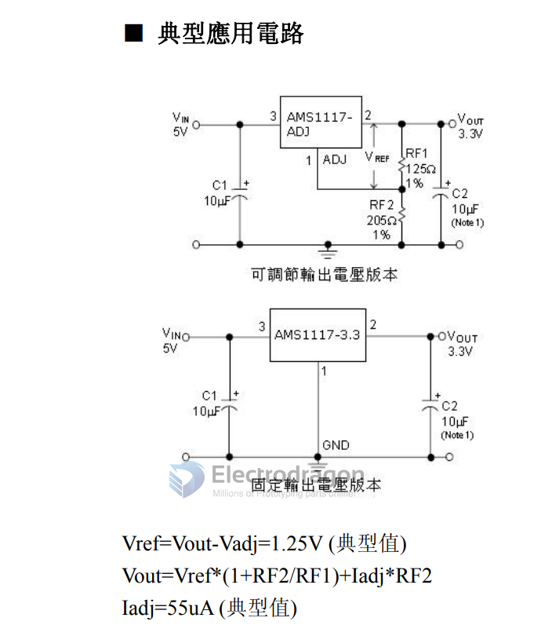
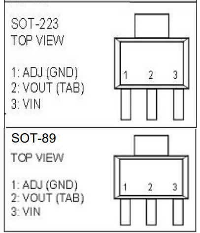

# AMS1117-dat 

## Minium Input voltage 

The AMS1117 is a low dropout linear voltage regulator, and its minimum input voltage depends on the specific output voltage version you are using. The dropout voltage is typically around 1.1V at full load (1A). Here's a breakdown:

For 3.3V output (AMS1117-3.3):

Minimum input voltage = 3.3V + 1.1V = 4.4V (recommended).

For 5.0V output (AMS1117-5.0):

Minimum input voltage = 5.0V + 1.1V = 6.1V (recommended).

**For proper operation, always ensure the input voltage is at least 1.1V above the desired output voltage under load conditions. **

Lower input voltages may cause instability or failure to regulate correctly.

## ref 

- [[AMS1117]]