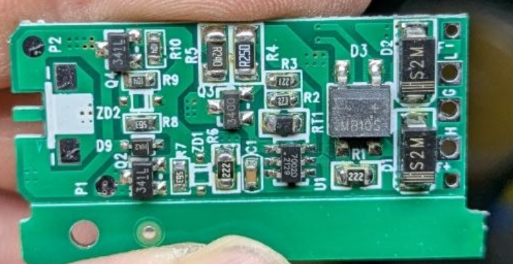

# AOSMD-dat

- [[3400-dat]] - [[3401-dat]] - [[AOSMD-dat]]

- [[AOD4184-dat]] == AOD4184/AOI4184

- [[AOD403-dat]]

## AO3401 

The marking code "341L" typically identifies the NP3401MR-G, a P-Channel Enhancement Mode MOSFET housed in a compact SOT-23 surface-mount package.

## AO3400

The `X01V` is a common silkscreen marking for the AO3400A (or AO3400). It is an N-Channel enhancement-mode MOSFET manufactured by Alpha & Omega Semiconductor, typically housed in a compact SOT-23 package.

- [[CN3302-dat]] - [[AOSMD-dat]] - [[mosfet-dat]]

## ref 