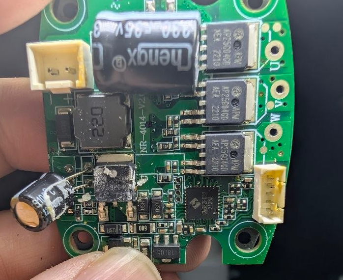

# APM-dat

- [[APM-dat]] - [[mosfet-dat]]

AP25G04 Power MOSFET - [[sytatek-dat]]

AP15N10D == 100V N-Channel Enhancement Mode MOSFET - [[APM-dat]]

The `AP50P04` (often listed as AP50P04D) is a -40V P-Channel enhancement-mode MOSFET manufactured by A-Power Electronics and others, typically housed in a TO-252 (D-PAK) package. It utilizes advanced trench technology to provide low on-resistance and is primarily designed for battery protection, load switches, and DC/DC switching applications.

## ref 

