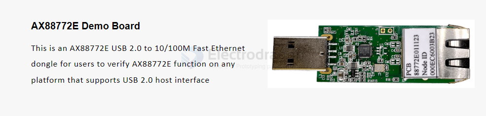
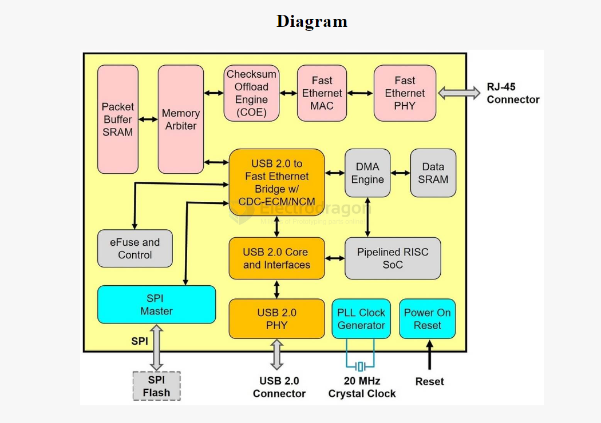

# AX88772-dat.md

https://www.asix.com.tw/en/product/USBEthernet/High-Speed_USB_Ethernet/AX88772E

The AX88772E is an easy-design, small form factor and cost-efficient solution, which adapts to any platforms required to support Fast Ethernet network connectivity via USB port and is suitable for Notebook/Laptop on-board LAN, USB Ethernet dongles, docking stations, POS/PDA cradles, game console, smart camera/IP STB, etc. smart home/office applications.

