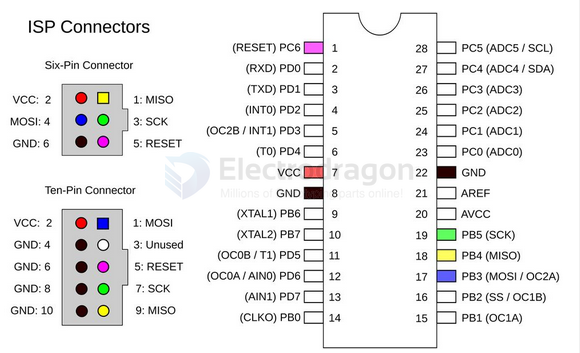

# AVR-dat

- [[tinyAVR-dat]] - [[avr128-dat]] - [[attiny-dat]] - [[atmega328-DAT]] - [[atmega32u4-dat]]

## PROG AVR 

a common DIP28 socket 

|         | atmega | Left | Right |      | atmega |
| ------- | ------ | ---- | ----- | ---- | ------ |
| D10     | RST    | 1    | 28    |      |        |
|         |        | 2    | 27    |      |        |
|         |        | 3    | 26    |      |        |
|         |        | 4    | 25    |      |        |
|         |        | 5    | 24    |      |        |
|         |        | 6    | 23    |      |        |
| +5V     | VCC    | 7    | 22    | GND  | GND    |
| GND     | GND    | 8    | 21    |      |        |
| crystal | X1     | 9    | 20    | +5V  | VCC    |
| crystal | X2     | 10   | 19    | SCK  | D13    |
|         |        | 11   | 18    | MISO | D12    |
|         |        | 12   | 17    | MOSI | D11    |
|         |        | 13   | 16    |      |        |
|         |        | 14   | 15    |      |        |

## repro 

- https://bitbucket.org/e_dragon/attiny88

## ref 

- 