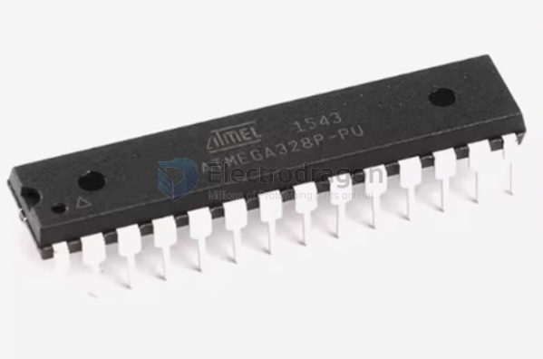
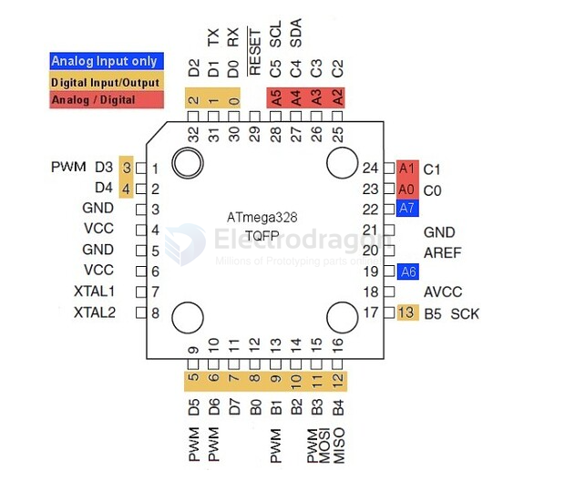
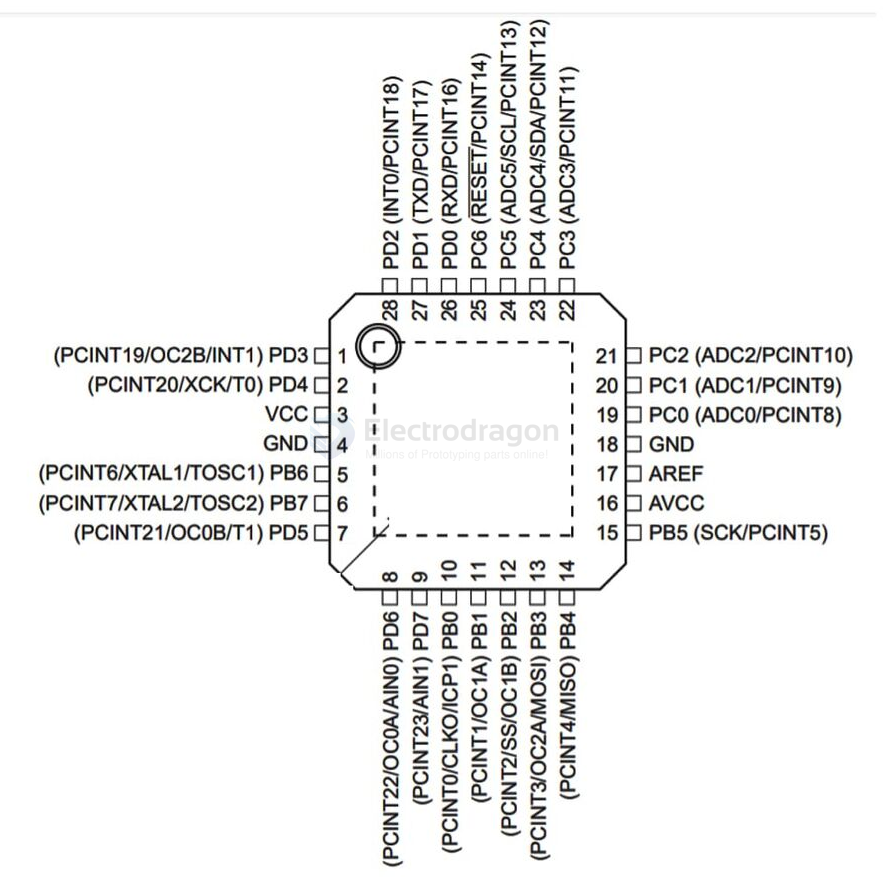

# atmega328-DAT

- legacy wiki page - https://w.electrodragon.com/w/Category:AVR

- chips offer - without bootloader [[CIC1042-dat]] - with bootloader [[CIC1013-dat]]

- [[TQFP-dat]]

## DIP 28

## TQFP 32 

## QFN 28 

Pins table

| arduino | pin | Funcs | Funcs2         | customize |
| ------- | --- | ----- | -------------- | --------- |
| D13     | 17  | PB5   | SPI_SCK/PCINT5 |           |
| D12     | 16  | PB4   | SPI_MISO       |           |
| D11     | 15  | PB3   | SPI_MOSI/PWM   |           |
| D10     | 14  | PB2   |                |           |
| D9      | 13  | PB1   | PWM            |           |
| D8      | 12  | PB0   |                |           |
| D7      | 11  | PD7   |                |           |
| D6      | 10  | PD6   | PWM            |           |
| D5      | 9   | PD5   | PWM            |           |
| D4      | 2   | PD4   |                |           |
| D3      | 1   | PD3   | PWM            |           |
| D2      | 32  | PD2   | irq            |           |
| D1      | 31  | PD1   | TX             |           |
| D0      | 30  | PD0   | RX             |           |
| A5      |     | PC5   | SCL            |           |
| A4      |     | PC4   | SDA            |           |
| A3      |     | PC3   |                |           |
| A2      |     | PC2   |                |           |
| A1      |     | PC1   |                |           |
| A0      |     | PC0   |                |           |

## atmega328PB

- DS pdf - https://ww1.microchip.com/downloads/en/DeviceDoc/40001906A.pdf
- chip page - https://www.microchip.com/en-us/product/atmega328pb

### comparsion: 

The difference between the 328 and 328P is "picopower", which might mean lower power consumption in powerdown modes, but the only visible difference is the ability to turn off brown-out detection in software.

The 328PB should have been a different part number :frowning: . It has extra I2C, SPI, and UART peripherals, two additional 16bit timers, the ability to use what were analog-only pins for digital IO, removes a set of power pins, has a unique serial number, clock failure detection, more explicit support for Touch IO, and isn't available in DIP. And the PB is cheaper.

- https://forum.arduino.cc/t/what-are-the-differences-of-atmega328-atmega328p-and-atmega-328pb/1153356/3

## ref 

- [[atmega328]]

- [[arduino-dat]]