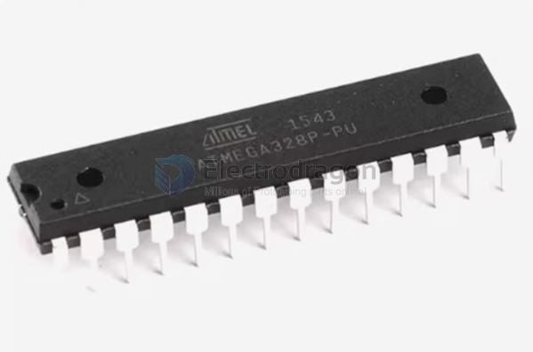
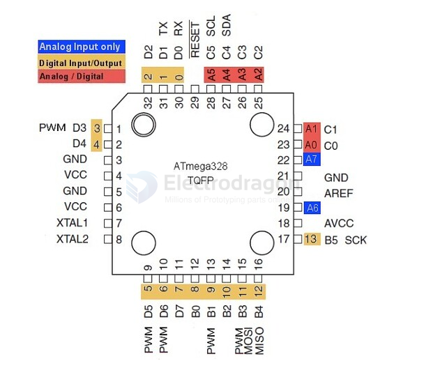
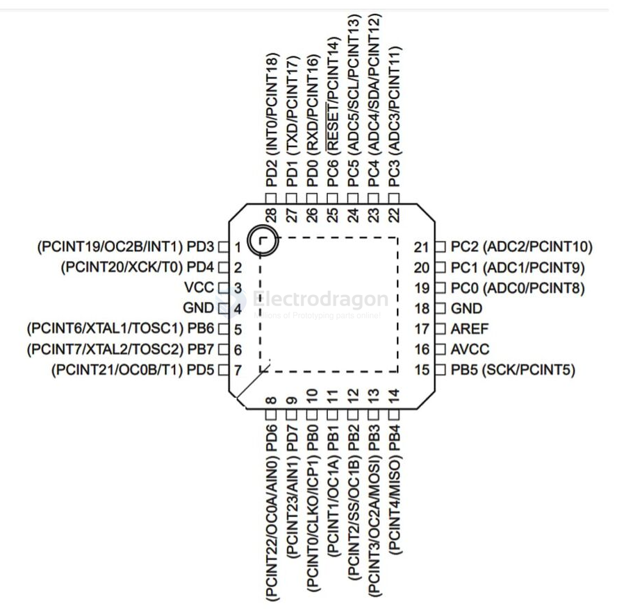

# atmega328-DAT

- legacy wiki page - https://w.electrodragon.com/w/Category:AVR

- chips offer - without bootloader [[CIC1042-dat]] - with bootloader [[CIC1013-dat]]

- [[TQFP-dat]]

- [[arduino-programmer-dat]] - [[USBASP-dat]]

## DIP 28

## TQFP 32 

## QFN 28 

Pins table

| pin | pin name | arduino | Funcs2         | customize |
| --- | -------- | ------- | -------------- | --------- |
| 17  | PB5      | D13     | SPI_SCK/PCINT5 |           |
| 16  | PB4      | D12     | SPI_MISO       |           |
| 15  | PB3      | D11     | SPI_MOSI/PWM   |           |
| 14  | PB2      | D10     |                |           |
| 13  | PB1      | D9      | PWM            |           |
| 12  | PB0      | D8      |                |           |
| 11  | PD7      | D7      |                |           |
| 10  | PD6      | D6      | PWM            |           |
| 9   | PD5      | D5      | PWM            |           |
| 2   | PD4      | D4      |                |           |
| 1   | PD3      | D3      | PWM            |           |
| 32  | PD2      | D2      | irq            |           |
| 31  | PD1      | D1      | TX             |           |
| 30  | PD0      | D0      | RX             |           |
|     | PC5      | A5      | SCL            |           |
|     | PC4      | A4      | SDA            |           |
|     | PC3      | A3      |                |           |
|     | PC2      | A2      |                |           |
|     | PC1      | A1      |                |           |
|     | PC0      | A0      |                |           |

## atmega328PB

- DS pdf - https://ww1.microchip.com/downloads/en/DeviceDoc/40001906A.pdf
- chip page - https://www.microchip.com/en-us/product/atmega328pb

### comparsion: 

The difference between the 328 and 328P is "picopower", which might mean lower power consumption in powerdown modes, but the only visible difference is the ability to turn off brown-out detection in software.

The 328PB should have been a different part number :frowning: . It has extra I2C, SPI, and UART peripherals, two additional 16bit timers, the ability to use what were analog-only pins for digital IO, removes a set of power pins, has a unique serial number, clock failure detection, more explicit support for Touch IO, and isn't available in DIP. And the PB is cheaper.

- https://forum.arduino.cc/t/what-are-the-differences-of-atmega328-atmega328p-and-atmega-328pb/1153356/3

## ref 

- [[atmega328]]

- [[arduino-dat]]