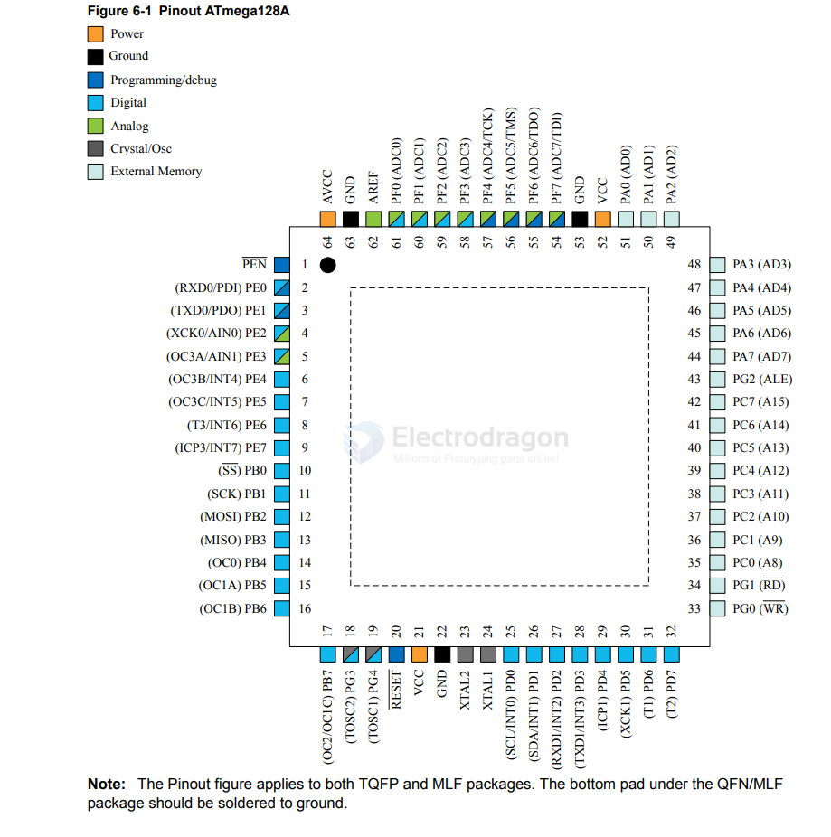

# atmega128-dat

- [[atmega128-dat]] - [[AVR-dat]] 

https://ww1.microchip.com/downloads/en/DeviceDoc/Atmel-8151-8-bit-AVR-ATmega128A_Datasheet.pdf

The Atmel®  ATmega128A is a low-power CMOS 8-bit microcontroller based on the AVR®  enhanced RISC architecture. By executing powerful instructions in a single clock cycle, the ATmega128A achieves throughputs close to 1MIPS per MHz. This empowers system designer to optimize the device for power consumption versus processing speed.

64-pin 

| Feature / Specification     | ATmega328                             | ATmega128A                           |
| :-------------------------- | :------------------------------------ | :----------------------------------- |
| **Core Architecture**       | 8-bit AVR RISC                        | 8-bit AVR RISC                       |
| **Flash Memory (Program)**  | 32 KB                                 | 128 KB                               |
| **SRAM (Internal Data)**    | 2 KB                                  | 4 KB                                 |
| **EEPROM**                  | 1 KB                                  | 4 KB                                 |
| **Max. Clock Frequency**    | 20 MHz                                | 16 MHz                               |
| **Max. Throughput**         | 20 MIPS                               | 16 MIPS                              |
| **Programmable I/O Lines**  | 23                                    | 53                                   |
| **Pin Count & Packages**    | 28-pin PDIP, 32-lead TQFP/QFN         | 64-lead TQFP/QFN                     |
| **Timers / Counters**       | 3 (2 x 8-bit, 1 x 16-bit)             | 4 (2 x 8-bit, 2 x 16-bit)            |
| **PWM Channels**            | 6                                     | 8                                    |
| **ADC Channels**            | 6 channels (PDIP) / 8 channels (TQFP) | 8 channels (includes 7 differential) |
| **ADC Resolution**          | 10-bit                                | 10-bit                               |
| **USART (Serial)**          | 1                                     | 2                                    |
| **SPI Interface**           | 1                                     | 1                                    |
| **I2C (TWI) Interface**     | 1                                     | 1                                    |
| **On-Chip Debugging**       | debugWIRE                             | JTAG                                 |
| **External Memory Support** | No                                    | Yes (up to 64 KB)                    |
| **Operating Voltage Range** | 1.8 V - 5.5 V                         | 2.7 V - 5.5 V                        |

- [[debugWire-dat]] - [[JTAG-dat]] - [[SDK-dat]] - [[OCD-dat]]

## ref 

- [[atmega128]] - [[AVR]]

