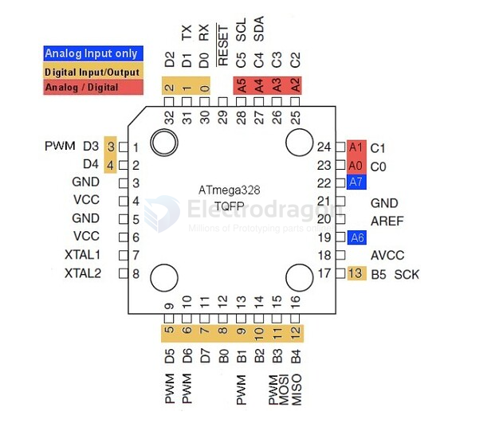
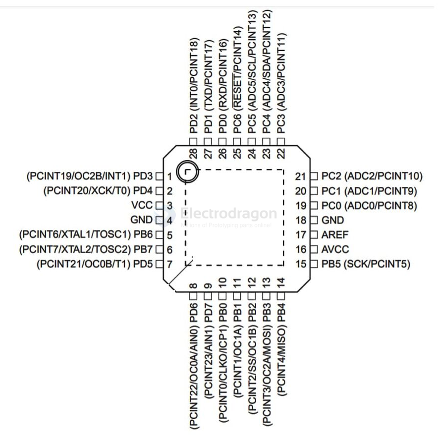

# atmega328-DAT

## TQFP 32 

## QFN 28 

Pins 

| pin | Funcs | Funcs2     | arduino |
| --- | ----- | ---------- | ------- |
| 15  | PB5   | SCK/PCINT5 | D13     |

- [[atmega328]]

- [[arduino-dat]]