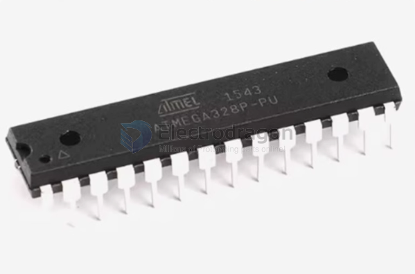

# atmega328-DAT

- legacy wiki page - https://w.electrodragon.com/w/Category:AVR

## DIP 28

## TQFP 32 

## QFN 28 

Pins 

| arduino | pin | Funcs | Funcs2     | customize |
| ------- | --- | ----- | ---------- | --------- |
| 13      | 17  | PB5   | SCK/PCINT5 |           |
| 12      | 16  | PB4   | MISO       |           |
| 11      | 15  | PB3   | MOSI/PWM   |           |
| 10      | 14  | PB2   |            |           |
| 9       | 13  | PB1   | PWM        |           |
| 8       | 12  | PB0   |            |           |
| 7       | 11  | PD7   |            |           |
| 6       | 10  | PD6   | PWM        |           |
| 5       | 9   | PD5   | PWM        |           |
| 4       | 2   | PD4   |            |           |
| 3       | 1   | PD3   | PWM        |           |
| 2       | 32  | PD2   |            |           |
| 1       | 31  | PD1   | TX         |           |
| 0       | 30  | PD0   | RX         |           |

## atmega328PB

- DS pdf - https://ww1.microchip.com/downloads/en/DeviceDoc/40001906A.pdf
- chip page - https://www.microchip.com/en-us/product/atmega328pb

### comparsion: 

The difference between the 328 and 328P is "picopower", which might mean lower power consumption in powerdown modes, but the only visible difference is the ability to turn off brown-out detection in software.

The 328PB should have been a different part number :frowning: . It has extra I2C, SPI, and UART peripherals, two additional 16bit timers, the ability to use what were analog-only pins for digital IO, removes a set of power pins, has a unique serial number, clock failure detection, more explicit support for Touch IO, and isn't available in DIP. And the PB is cheaper.

- https://forum.arduino.cc/t/what-are-the-differences-of-atmega328-atmega328p-and-atmega-328pb/1153356/3

## ref 

- [[atmega328]]

- [[arduino-dat]]