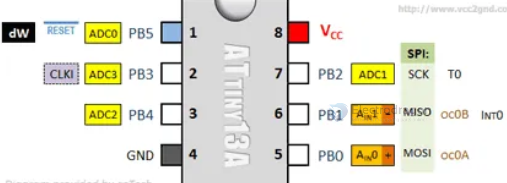

# attiny-dat 

## HDK 

### megaTinyCore Series 

- env setup [[megaTinyCore]]

- [[attiny1604-dat]]

QFN
- [[ATtiny416-dat]]

### Attiny 13A 

- PB3 = D3 = 3

## SDK

- arduino attiny - http://code.google.com/p/arduino-tiny/

- http://playground.arduino.cc/Main/ArduinoOnOtherAtmelChips

- tuto - http://highlowtech.org/?p=1695

## ref

- [[arduino-ide-dat]]

- [[DPR1045-dat]]