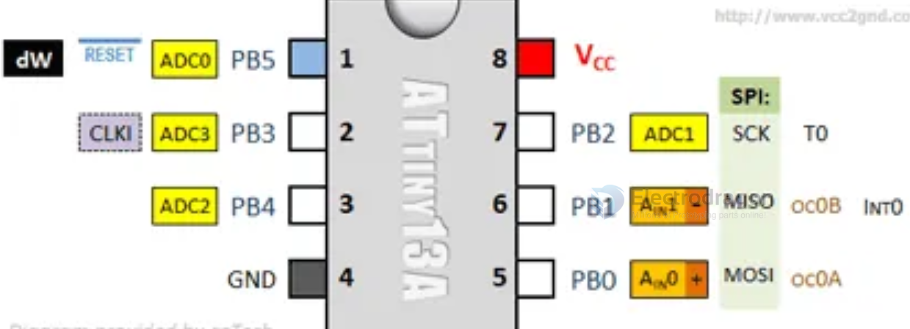
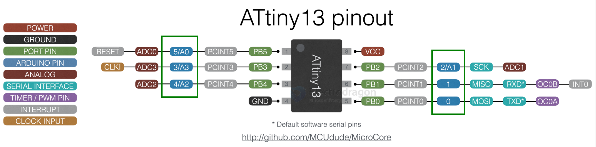

# attiny13-dat

## Attiny 13A 

## Based on MicroCore 

GPIOs 

- PB0 = D0 = 0
- PB1 = D1 = 1
- PB2 = D2 = 2
- PB3 = D3 = 3
- PB4 = D4 = 4
- PB5 = D5 = 5

proramming 

- ATtiny13A leg 1 -> Arduino 10
- ATtiny13A leg 5 -> Arduino 11
- ATtiny13A leg 6 -> Arduino 12
- ATtiny13A leg 7 -> Arduino 13

- ATtiny13A leg 8 -> 5v
- ATtiny13A leg 4 -> Ground (GND)

## ref 

- [[attiny-dat]] - [[avr-dat]]