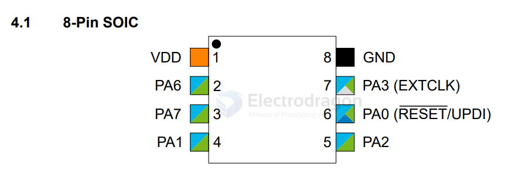

# tinyAVR-dat

- [[avr-app-dat]] - [[avr-dat]]

- [[megaTinyCore-dat]]

programming - [[UPDI-dat]]

## HDK 

### megaTinyCore Series 

- env setup [[megaTinyCore]] - [[megaCoreX-dat]]

- [[attiny1604-dat]] 
  
- [[attiny1616-dat]] - [[attiny1617-dat]]

- [[attiny416-dat]] == QFN

- attiny404

## our APP boards 

- [[ILE1073-dat]] - [[SVC1039-dat]]

## 0-series 

### attiny202

https://www.microchip.com/en-us/product/attiny202

ATtiny202/204/402/404/406 Automotive tinyAVR 0-series

SOP 8 attiny202 - [[ILE1073-dat]]

| design | extra | arduino | index | left | right | index | arduino | extra | design |
| ------ | ----- | ------- | ----- | ---- | ----- | ----- | ------- | ----- | ------ |
|        |       |         | 1     | VCC  | GND   | 8     |         |       |        |
|        | TXD0  | 0       | 2     | PA6  | PA3   | 7     | 4       |       |        |
|        | RXD0  | 1       | 3     | PA7  | PA0   | 6     | 5       | UPDI  |        |
|        | TXD2  | 2       | 4     | PA1  | PA2   | 5     | 3       | RXD2  |        |

PWM pin 

"ERROR: Upload using programmer is not supported on optiboot boards

### attiny1604 == 16K 14 pin 

https://ww1.microchip.com/downloads/en/DeviceDoc/ATtiny804_1604-Data-Sheet-40002028A.pdf

https://github.com/SpenceKonde/megaTinyCore/blob/master/megaavr/extras/ATtiny_x04.gif

| design | extra | arduino | index | left | right | index | arduino | extra    | design |
| ------ | ----- | ------- | ----- | ---- | ----- | ----- | ------- | -------- | ------ |
|        |       |         | 1     | VCC  | GND   | 14    |         |          |        |
|        |       | 0       | 2     | PA4  | PA3   | 13    | 10      |          |        |
|        |       | 1       | 3     | PA5  | PA2   | 12    | 9       |          |        |
|        |       | 2       | 4     | PA6  | PA1   | 11    | 8       |          |        |
|        |       | 3       | 5     | PA7  | PA0   | 10    | 11      | RST/UPDI |        |
|        |       | 4       | 6     | PB3  | PB0   | 9     | 7       |          |        |
|        |       | 5       | 7     | PB2  | PB1   | 8     | 6       |          |        |

## programming 

- [[UPDI-dat]] - [[avrdude-dat]]

## repo code 

- https://github.com/Edragon/Arduino-attiny

## ref 

- [[arduino-dat]]

- [[avr-dat]]