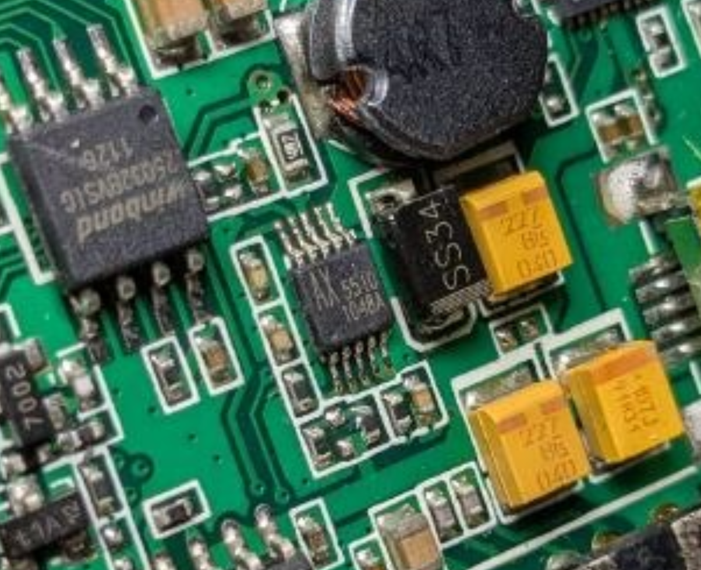

# AX5510-dat

Package Type	MSOP8/10-EP， TDFN10， SOP8-EP
Input Voltage	2.6 to 5.5V
Switching Current	3A
Output Voltage	27V(Vfb=1.238V)
Frequency	1.2M/680KHz
Shutdown Current	1uA (Max)
Efficiency(%)	92(5 to 24V/0.2A)
Availability	NOW

- [[RT3505-dat]]

http://www.axelite.com.tw/ProductDetail.aspx?id=4cdb0722-9f84-459e-b0f8-9c0a617a2ae7&cid=&sid=

The AX5510 is a high performance, high efficiency step up DC-DC Converter with integrated 3A. 

The AX5510 converter input voltage ranging from 2.6 to 5.5V. The Output voltage can be set up to 27V. 

The selectable frequency of 680 kHz and 1.2 MHz allows the use of small external inductors and capacitors and provides fast transient response. Current mode control with external compensation network makes it easy to stabilize the system and keep maximum flexibility. 

Programmable soft start function minimizes impact on the input power system. Internal power MOSFET with very low RDS (ON) provides high efficiency.

The AX5510 automatically transits from PWM to PFM during light load condition further increasing efficiency. The converter also provides protection functions such as Current Limit and Thermal shutdown. 

The AX5510 is available in space-saving MSOP-10L-EP, MOSP-8L-EP, TDFN-10L and SOP-8L-EP packages.

