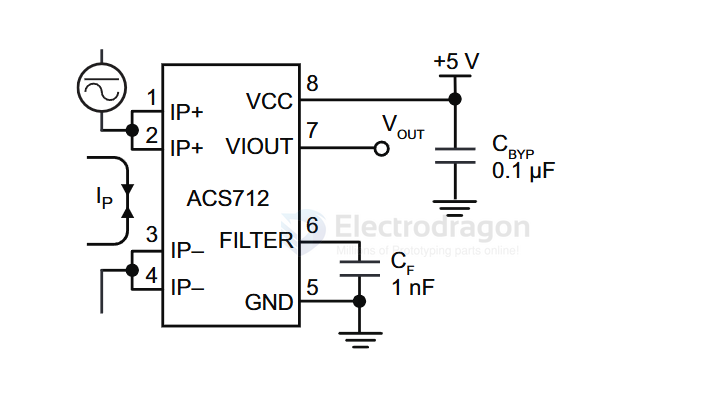
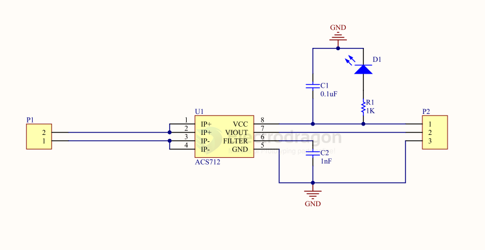

# ACS712-dat

- [[meter-current-dat]] - [[SVC1022-dat]] - [[SVC1023-dat]] - [[SVC1024-dat]]

- [[SVC1000-dat]] - [[SVC1002-dat]] - [[SVC1004-dat]] - [[ACS712-dat]]

- [[VRMS-dat]] - [[ACS712-dat]]

[legacy wiki page](https://w.electrodragon.com/w/ACS712)

Fully Integrated, Hall Effect-Based Linear Current Sensor  

with 2.1 kVRMS Voltage Isolation and a Low-Resistance Current Conductor

## tutorial 

- https://blog.electrodragon.com/acs712-current-sensor-read/

## APP SCH 

## boards 

- [[SVC1002-dat]] - [[SVC1004-dat]]

## code 

- [[ACS712-test-1.ino]]

## SCH 

## ref 

- datasheet - [[ACS712-DS.pdf]]

- [[cross-chip-dat]] - [[CC6902-dat]] - [[ACS712-dat]]

- [[ESP32-dat]]