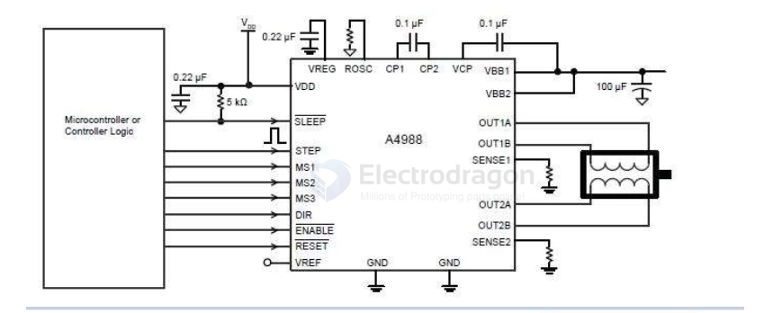
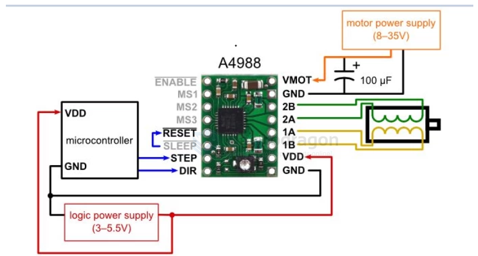
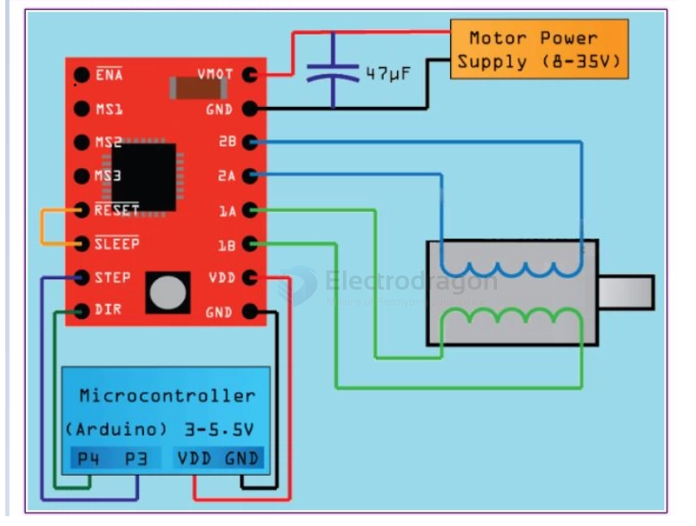

# a4988-dat

- [[SDR1042-dat]] [[A4988-dat]] - [[DRV8825-dat]]

The A4988 is a complete microstepping motor driver with built-in translator for easy operation. 

It is designed to operate bipolar stepper motors in full-, half-, quarter-, eighth-, and sixteenth-step modes, with an output drive capacity of up to 35 V and ±2 A. 

The A4988 includes a fixed off-time current regulator which has the ability to operate in Slow or Mixed decay modes.

- [[a4988.pdf]]

## info 

注意：A4988绿色跟红色是一样 1A的  

简介

A4988 是一款完全的微步电动机驱动器，带有内置转换器，易于操作。该产品可在全、半、1/4、1/8 及 1/16 步进模式时操作双极步进电动机，输出驱动性能可达 16V 及 ±1  A。一般用12V，A4988 包括一个固定关断时间电流稳压器，该稳压器可在慢或混合衰减模式下工作。转换器是 A4988 易于实施的关键。只要在“步进”输入中输入一个脉冲，即可驱动电动机产生微步。无须进行相位顺序表、高频率控制行或复杂的界面编程。A4988 界面非常适合复杂的微处理器不可用或过载的应用。

在微步运行时，A4988 内的斩波控制可自动选择电流衰减模式（慢或混合）。在混合衰减模式下，该器件初始设置为在部分固定停机时间内快速衰减，然后在余下的停机时间慢速衰减。混合衰减电流控制方案能减少可听到的电动机噪音、增加步进度并减少功耗。提供内部同步整流控制电路，以改善脉宽调制 (PWM) 操作时的功率消耗。内部电路保护包括：带滞后的过热关机、欠压锁定 (UVLO) 及交叉电流保护。不需要特别的通电排序。

A4988 采用表面安装 QFN 封装 (ES),尺寸为 5 mm × 5 mm, 标称整体封装高度为 0.90 mm ，并带有外露散热板以增强散热功能。该封装为无铅封装（后缀 –T），采用 雾锡电镀引脚框。

 

功能及优点
- 低 RDS(开)输出
- 自动电流衰减模式检测/选择
- 混合与慢电流衰减模式
- 对低功率耗散同步整流
- 内部 UVLO
- 交叉电流保护
- 3.3 及 5 V 兼容逻辑电源
- 过热关机电路
- 接地短路保护
- 加载短路保护
- 五个可选的步进模式：全、 1/2、1/4、1/8 及 1/16

## SCH 

## wiring 

## ref 

