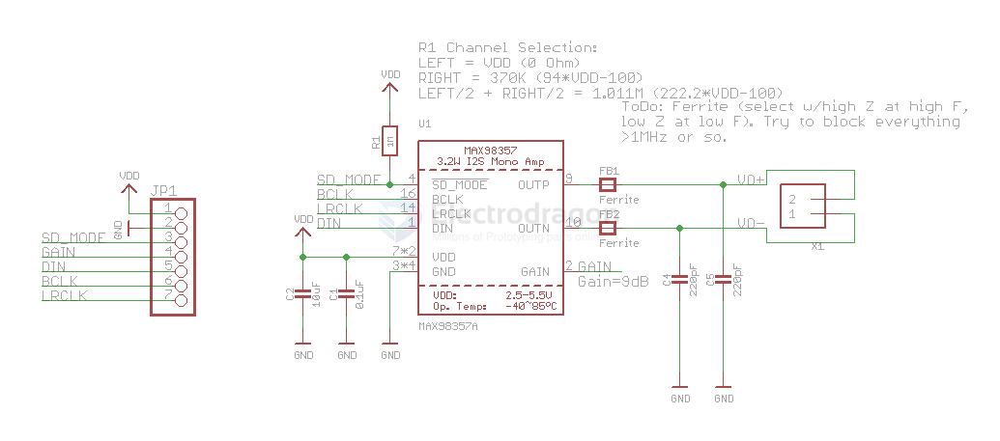
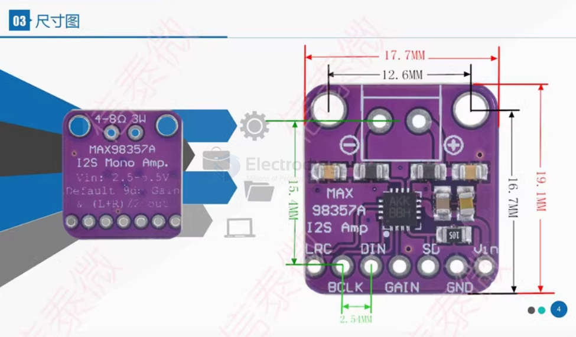

# MAX98357

- PCM Input Class D Audio Power Amplifiers

## Features 

- 01 Output power: 3.2W at 4Ω, THD 10% 1.8W at 8Q, THD 10%
- 02 I2S sampling rate: 8kHz-96kHz
- 03 Selectable class D amplifier gain: 3dB/6dB/9dB/12dB/15dB
- 04 No master clock (MCLK) required
- 05 Plug and play: only a single power supply is needed, 35 different clocks and 128 digital audio formats can be automatically configured
- 06 Suitable for microcontrollers or development board systems with I2S audio output such as RaspberryPi, ArduinoL and ESP32

## SCH

## Pins 

- LRC: Left/right clock synchronization clock for I2S and LJ modes for TDM mode
- BCLK: Bit clock input
- DIN: Digital input signal
- GAIN: Gain and channel selection In TDM mode, the gain is fixed at 12dB
- SD: Shutdown and channel selection. SD_MODE is pulled low to put the device in shutdown state
- GND: Power ground
- VCC: Power positive, DC2.5V-5.5V

## wiring 

## Dimension 

## code 

- [[MAX98357-code.ino]] - [[I2S-dat]]

## ref 

- [[I2S-dat]] 

- [[MAX98357-datasheet.pdf]]