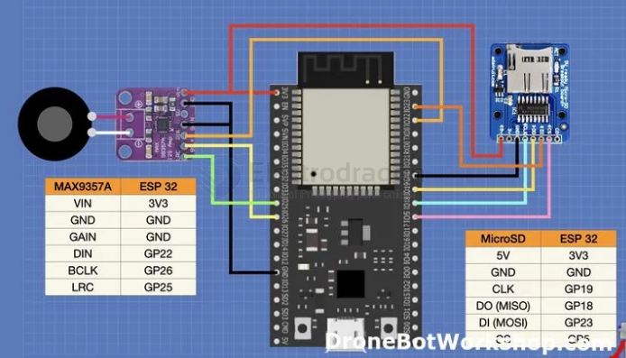
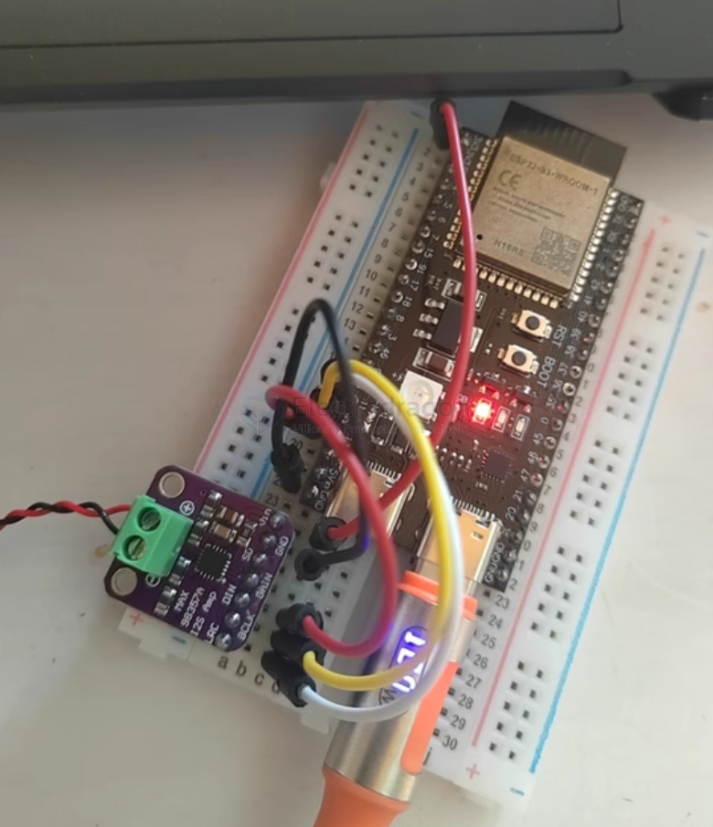

# MAX98357

- PCM Input Class D Audio Power Amplifiers

## Features 

- 01 Output power: 3.2W at 4Ω, THD 10% 1.8W at 8Q, THD 10%
- 02 I2S sampling rate: 8kHz-96kHz
- 03 Selectable class D amplifier gain: 3dB/6dB/9dB/12dB/15dB
- 04 No master clock (MCLK) required
- 05 Plug and play: only a single power supply is needed, 35 different clocks and 128 digital audio formats can be automatically configured
- 06 Suitable for microcontrollers or development board systems with I2S audio output such as RaspberryPi, ArduinoL and ESP32

## SCH

## Pins 

- [[I2S-dat]]

| Pin  | ESP32 | ESP32-S3 | Note                                                                                      |
| ---- | ----- | -------- | ----------------------------------------------------------------------------------------- |
| LRC  | 25    | 11       | Left/right clock synchronization clock for I2S and LJ modes for TDM mode                  |
| BCLK | 5     | 12       | Bit clock input                                                                           |
| DIN  | 26    | 13       | Digital input signal                                                                      |
| GAIN |       |          | Gain and channel selection In TDM mode, the gain is fixed at 12dB                         |
| SD   |       |          | Shutdown and channel selection. SD_MODE is pulled low to put the device in shutdown state |
| GND  |       |          | Power ground                                                                              |
| VCC  |       |          | Power positive, DC2.5V-5.5V                                                               |

- [[arduino-ESP32-dat]]

## wiring 

## Use with ESP32-S3 

- [[ESP32-S3-board-dat]] i2s.setPins(12, 11, 13, -1, -1);
- pull SD high to use 
- IO17
- IO16
- IO15 

## Dimension 

## code 

- [[MAX98357-code.ino]] - [[I2S-dat]]

### code common error: 

i2s_write_bytes((i2s_port_t)0, (const char *)data, numData, portMAX_DELAY);
- 'i2s_write_bytes' was not declared in this scope

## ref 

- [[I2S-dat]] 

- [[MAX98357-datasheet.pdf]]