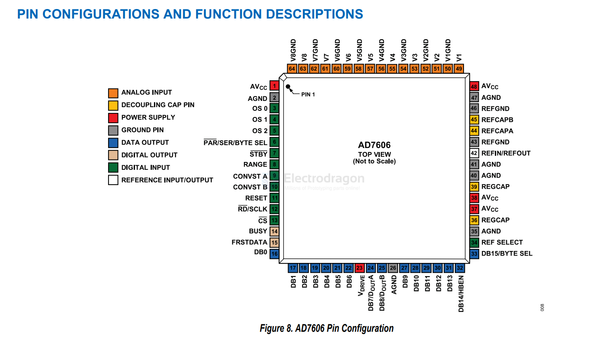
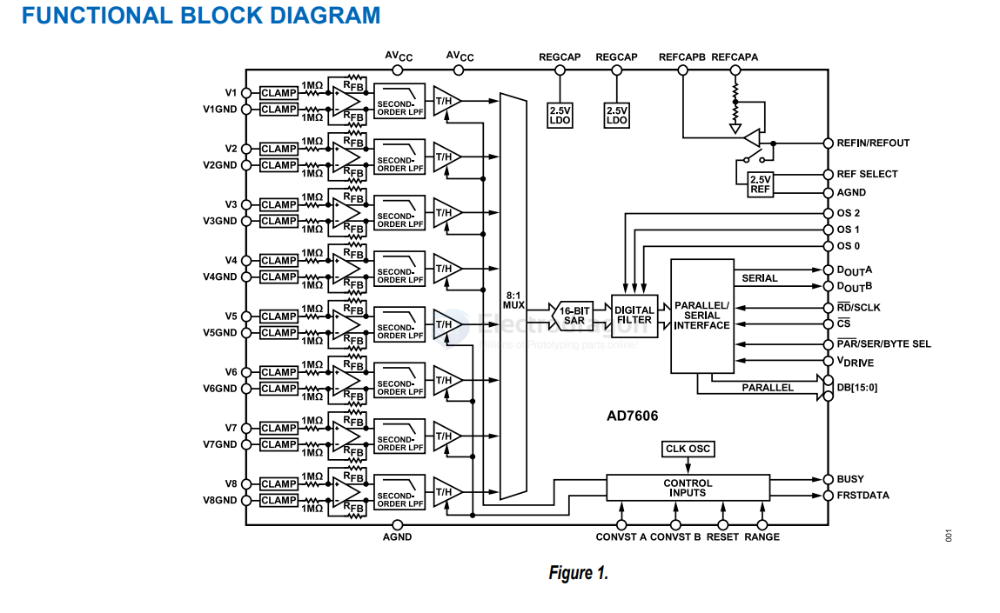

# AD7606-dat

- [[analog-device-dat]] - [[AD-ADC-dat]] - [[ADC-dat]] - [[AD7606-dat]]

- [[AD7606-dat]]

AD7606/AD7606-6/AD7606-4 == 8-/6-/4-Channel DAS with 16-Bit, Bipolar Input, Simultaneous Sampling ADC

https://www.analog.com/media/en/technical-documentation/data-sheets/AD7606_7606-6_7606-4.pdf

diagram

## ref 

