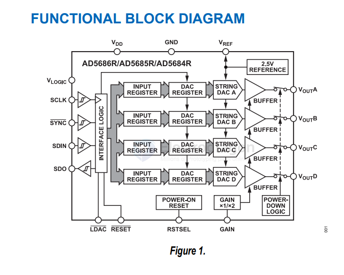

# AD-digital-dat

- [[DAC-dat]] - [[ADC-dat]] - [[AD-DAC-dat]] - [[AD-ADC-dat]]

- [[AD9850-dat]] - [[analog-device-dat]]

- [[AD-ADC-dat]] - [[AD-DAC-dat]] - [[analog-device-dat]] - [[AD-DAC-dat]]

- [[DDS-dat]] - [[DAC-dat]] - [[clock-multiplier-dat]] - [[filter-digital-dat]] - [[DSP-dat]] - [[AD9857-dat]] - [[analog-device-dat]]

## DAC 

`AD9142ABCPZ` == Dual, 16-Bit, 1600 MSPS, TxDAC+ Digital-to-Analog Converter

Supports input data rate up to 575 MHz

https://www.analog.com/media/en/technical-documentation/data-sheets/ad9142a.pdf

`AD9172BBPZ` == Dual, 16-Bit, 12.6 GSPS RF DAC with Channelizers

The AD9172 is a high performance, dual, 16-bit digital-to-analog converter (DAC) that supports DAC sample rates to 12.6 GSPS. The device features an 8-lane, 15 Gbps JESD204B data input port, a high performance, on-chip DAC clock multiplier, and digital signal processing capabilities targeted at single-band and multiband direct to radio frequency (RF) wireless applications.

https://www.analog.com/media/en/technical-documentation/data-sheets/ad9172.pdf

AD5686R/AD5685R/AD5684R == AD5684 == Quad, 12-Bit nanoDAC+ with 2 ppm/°C On-Chip Reference and SPI Interface

Quad, 16-/14-/12-Bit nanoDAC+ with 2 ppm/°C Reference, SPI Interface

## ref 

