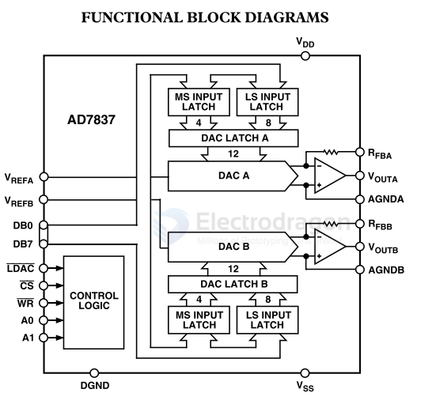

# AD7847-dat

- [[AD7847-dat]] - [[AD-DAC-dat]]

AD7837/AD7847

LC²MOS Complete, Dual 12-Bit MDACs

GENERAL DESCRIPTION
The AD7837/AD7847 is a complete, dual, 12-bit multiplyingdigital-to-analog converter with output amplifiers on a mono-lithic CMOS chip. No external user trims are required toachieve full specified performance.
Both parts are microprocessor compatible, with high speed datalatches and interface logic. The AD7847 accepts 12-bit paralleldata which is loaded into the respective DAC latch using theWR input and a separate Chip Select input for each DAC. TheAD7837 has a double-buffered 8-bit bus interface structurewith data loaded to the respective input latch in two write opera-tions. An asynchronous LDAC signal on the AD7837 updatesthe DAC latches and analog outputs.
The output amplifiers are capable of developing ±10 V across a2 kΩ load. They are internally compensated with low input off-set voltage due to laser trimming at wafer level.
The amplifier feedback resistors are internally connected toVoυT on the AD7847.
The AD7837/AD7847 is fabricated in Linear Compatible CMOS(LC²MOS), an advanced, mixed technology process that com-bines precision bipolar circuits with low power CMOS logic.
A novel low leakage configuration ensures low offset errors overthe specified temperature range.

## SCH 

## ref 