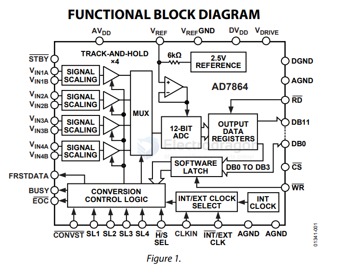

# AD7864-dat

- [[AD-DAC-dat]] - [[AD7864-dat]]

4-Channel, Simultaneous Sampling, High Speed, 12-Bit ADC

FEATURES
High speed (1.65 μs) 12-bit ADC
4 simultaneously sampled inputs
4 track-and-hold amplifiers
0.35 μs track-and-hold acquisition time
1.65 μs conversion time per channel
HW/SW select of channel sequence for conversion
Single-supply operation
Selection of input ranges
±10 V, ±5 V for AD7864-1
±2.5 V for AD7864-3 0 V to 2.5 V, 0 V to 5 V for AD7864-2
High speed parallel interface that allows
Interfacing to 3 V processors
Low power, 90 mW typical
Power saving mode, 20 μW typical
Overvoltage protection on analog inputs
APPLICATIONS
AC motor control
Uninterrupted power supplies
Data acquisition systems
Communications 

## diagram 

## ref 

