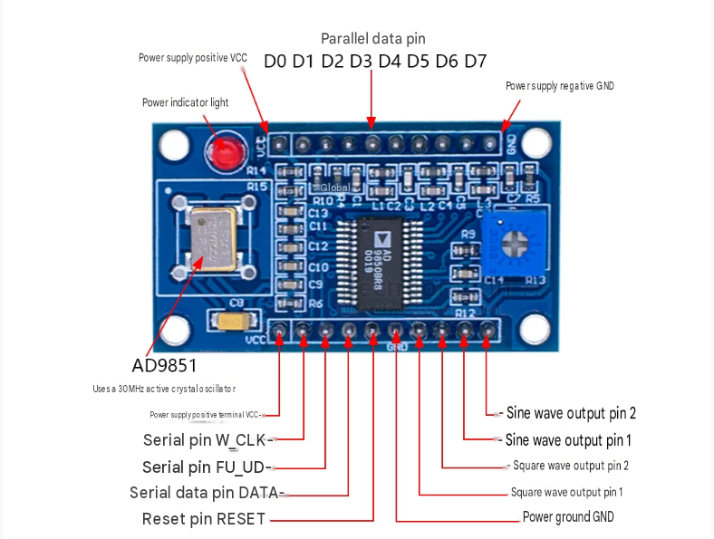
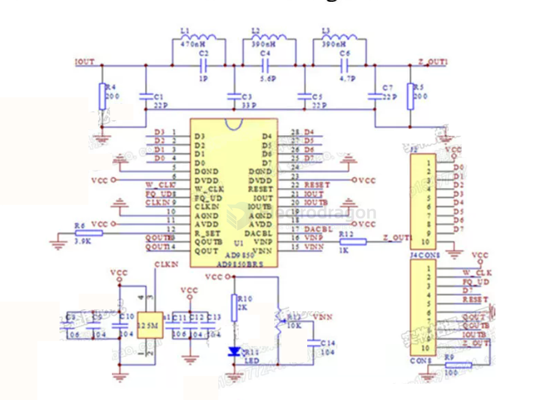

# AD9850-dat

- [[AD9850-dat]] - [[DDS-dat]] - [[AD-digital-dat]] - [[digital-dat]]

## board 

`Direct Digital Synthesizer (DDS)` is essentially a frequency divider: it divides the system clock (SYSTEM CLOCK) by programming the frequency control word to generate the desired frequency. DDS has two prominent features — on one hand, DDS operates in the digital domain; once the frequency control word is updated, the output frequency changes accordingly, offering high frequency hopping speed. On the other hand, due to the wide width of the frequency control word (48-bit or higher), the frequency resolution is high. The internal structure of DDS is mainly divided into three parts: phase accumulator, phase-to-amplitude converter, and digital-to-analog converter (DAC).

Key Features:
- The module can output sine waves and square waves, with 2 sine wave and 2 square wave outputs.
    - AD9850: 0-40MHz
    - AD9851: 0-70MHz
    - Above 20-30MHz, harmonics increase and the waveform becomes increasingly impure
    - Square wave: 0-1MHz
- Uses a 70MHz low-pass filter for better signal-to-noise ratio
- 10-bit DAC, 32-bit frequency control word
- The comparator's reference input voltage is generated by a variable resistor; adjusting this resistor yields square waves with different duty cycles
    - Note: When outputting sine waves, connect to the square wave output IO pin and adjust the blue potentiometer directly to output a square wave
- The AD9850 module uses a 125MHz active crystal oscillator; the AD9851 module uses a 30MHz active crystal oscillator

Main Differences Between AD9850 and AD9851
- AD9850 has a maximum clock frequency of 125MHz; AD9851 has a maximum clock frequency of 180MHz (30MHz*6). The maximum output frequency of AD9851 is higher than that of AD9850.
- AD9850 does not have 6x frequency multiplication; AD9851 does.

## SCH 

## ref 

