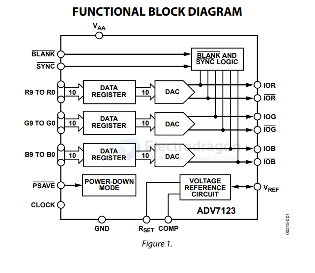
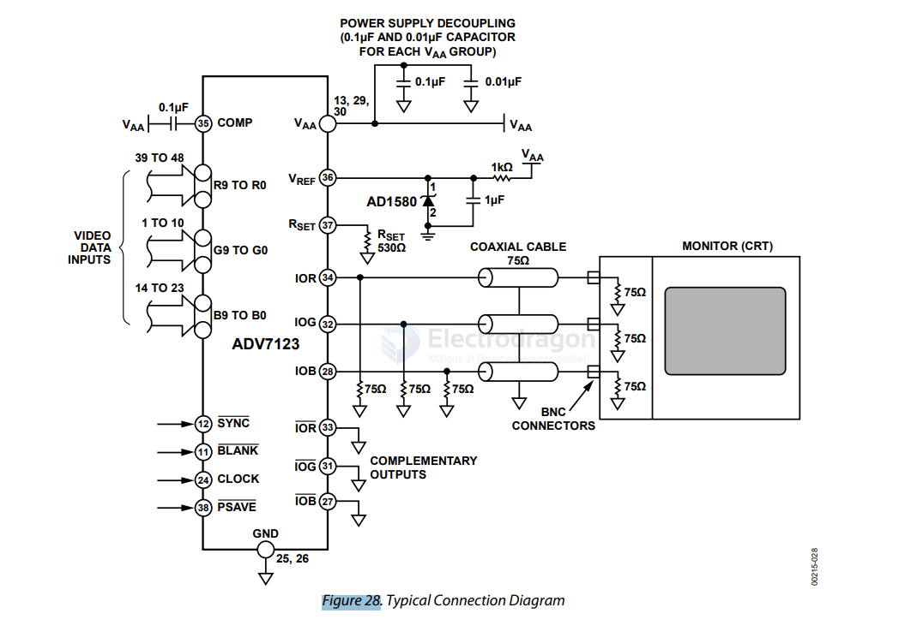

# ADV7123-dat
 

- [[RS170-dat]] - [[RS232-dat]] - [[RS343-dat]] - [[ADV7123-dat]] - [[video-dat]] - [[interface-dat]] - [[AD-DAC-dat]] - [[DAC-dat]]

- [[ADV7123-dat]] - [[buffer-dat]]

ADV7123 - CMOS, 330 MHz Triple 10-Bit High Speed Video DAC

- [[RS170-dat]] - [[RS232-dat]] - [[RS343-dat]] - [[ADV7123-dat]] - [[video-dat]] - [[interface-dat]] - [[AD-DAC-dat]] - [[DAC-dat]]

- [[video-dat]] - [[DAC-dat]]

https://www.analog.com/media/en/technical-documentation/data-sheets/ADV7123.pdf

## function diagram 

## video diagram 

- [[video-CRT-dat]] - [[video-dat]]

## ref 

