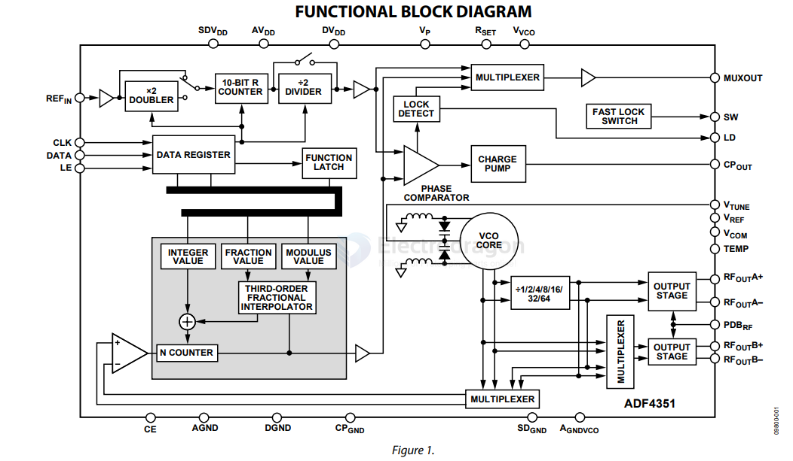

# AD-DDS-dat

- [[AD9850-dat]] 

- [[ADF4351-dat]] - Wideband Synthesizer with Integrated VCO - [[frequency-dat]]

- [[DDS-dat]] - [[AD-DDS-dat]] - [[digital-dat]]

- [[Synthesizer-dat]] - [[digital-dat]] - [[AD-DDS-dat]] - [[DDS-dat]] - [[analog-device-dat]]

ADF4351 

The ADF4351 allows implementation of fractional-N or integer-N phase-locked loop (PLL) frequency synthesizers when used with an external loop filter and external reference frequency.

The ADF4351 has an integrated `voltage controlled oscillator (VCO)` with a fundamental output frequency ranging from 2200 MHz to 4400 MHz. In addition, divide-by-1/-2/-4/-8/-16/-32/-64 circuits allow the user to generate RF output frequencies as low as 35 MHz. For applications that require isolation, the RF output stage can be muted. The mute function is both pin- and software-controllable. An auxiliary RF output is also available, which can be powered down when not in use.

Control of all on-chip registers is through a simple 3-wire interface.

The device operates with a power supply ranging from 3.0 V to 3.6 V and can be powered down when not in use.

diagram

## ref 

