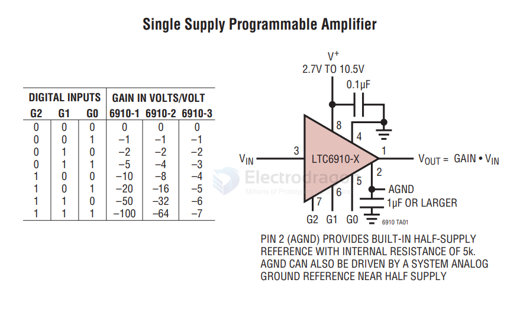

# AD-amplifier-dat

- [[AD620-dat]] - [[AD-amplifier-dat]] - 

- [[AD-amplifier-dat]] - [[amplifier-dat]]

MAX9938 - nanoPower, 4-Bump UCSP/SOT23, Precision Current-Sense Amplifier

TC6910-1/LTC6910-2/LTC6910-3 == Digitally Controlled Programmable Gain Amplifiers in SOT-23

## ref 

