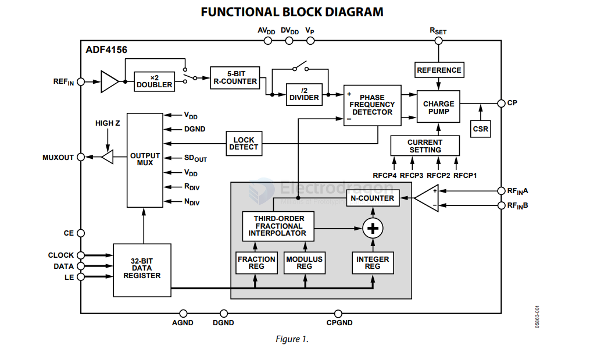
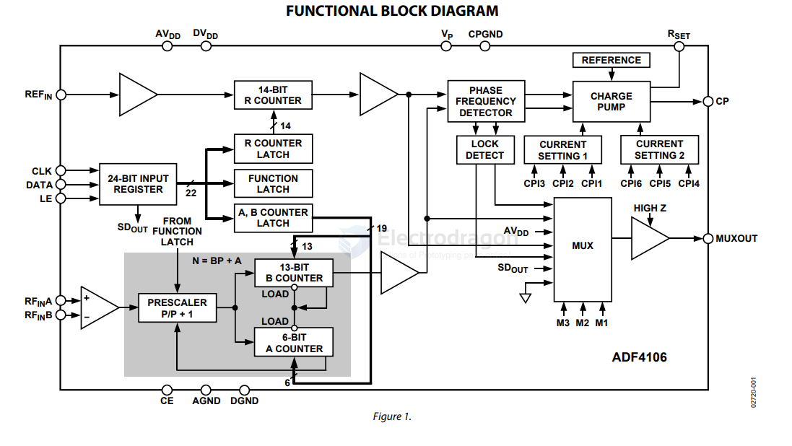

# AD-digital-dat

- [[analog-device-dat]] - [[AD-digital-dat]] - [[Digital-Synthesizer-dat]] - [[AD-DDS-dat]] - [[AD-DAC-dat]]

## ADF4156

6.2 GHz Fractional-N Frequency Synthesizer

https://www.analog.com/media/en/technical-documentation/data-sheets/ADF4156.pdf

The ADF4156 is a 6.2 GHz fractional-N frequency synthesizer that implements local oscillators in the upconversion and downconversion sections of wireless receivers and transmitters. 

It consists of a low noise digital phase frequency detector (PFD), a precision charge pump, and a programmable reference divider. There is a Σ-Δ based fractional interpolator to allow programmable fractional-N division. The INT, FRAC, and MOD registers define an overall N divider (N = (INT + (FRAC/MOD))). The RF output phase is programmable for applications that require a particular phase relationship between the output and the reference. The ADF4156 also features cycle slip reduction circuitry, leading to faster lock times without the need for modifications to the loop filter.

## AD9858

AD9858 - 1 GSPS Direct Digital Synthesizer

## ADF4106

ADF4106 - PLL Frequency Synthesizer

https://www.analog.com/media/en/technical-documentation/data-sheets/ADF4106.pdf

The ADF4106 frequency synthesizer can be used to implement
local oscillators in the up-conversion and down-conversion
sections of wireless receivers and transmitters. It consists of a
low noise, digital phase frequency detector (PFD), a precision
charge pump, a programmable reference divider, programmable
A counter and B counter, and a dual-modulus prescaler (P/P + 1).
The A (6-bit) counter and B (13-bit) counter, in conjunction
with the dual-modulus prescaler (P/P + 1), implement an N
divider (N = BP + A). In addition, the 14-bit reference counter
(R Counter) allows selectable REFIN frequencies at the PFD
input. A complete phase-locked loop (PLL) can be implemented
if the synthesizer is used with an external loop filter and voltage
controlled oscillator (VCO). Its very high bandwidth means
that frequency doublers can be eliminated in many high
frequency systems, simplifying system architecture and
reducing cost.

## ref 