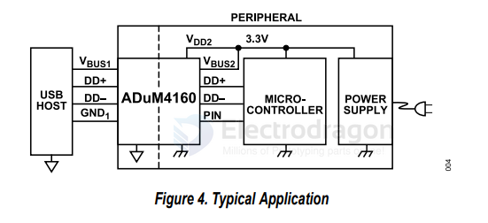

# AD-digital-isolator-dat

- [[AD-digital-isolator-dat]] - [[isolator-dat]] - [[analog-device-dat]]

ADuM4400/ADuM4401/ADuM4402 == 5 kV RMS Quad-Channel Digital Isolators

ADuM3400/ADuM3401/ADuM3402 - Quad-Channel, Digital Isolators, Enhanced System-Level ESD Reliability

Quad-Channel Digital Isolators

## adum 

ADUM1401ARWZ-RL ADI 2024+ 0.65usd

AD8221BRZ-R7 ADI 2024+ 2usd    

ADUM3402ARWZ-RL ADI 2021+ 2.7usd

ADUM5000ARWZ-RL ADI 2022+ 2.52usd

ADUM3400BRWZRL

## ADUM4160

- [[CONN-USB-dat]] - [[AD-digital-isolator-dat]]

ADUM4160BRIZ == USB Digital Isolator 5000Vrms 1 Channel 12Mbps 25kV/µs CMTI 16-SOIC (0.295", 7.50mm Width)

## ref 

