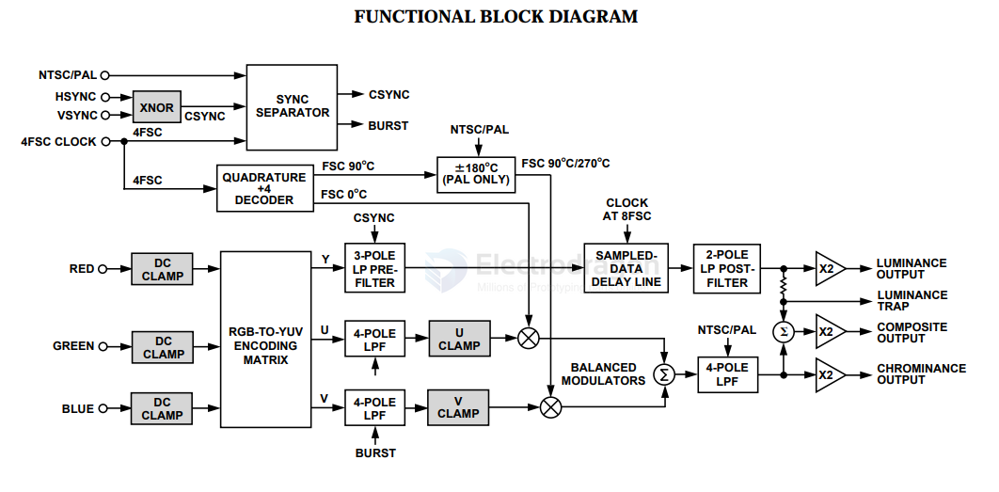

# AD725-dat

- [[AD725-dat]] - [[AD-ADV-dat]]

- [[video-dat]] - [[video-RGB-dat]] - [[video-NTSC-dat]] - [[video-PAL-dat]] - [[video-encoder-dat]]

Low Cost RGB to NTSC/PAL Encoder with Luma Trap Port

https://www.analog.com/media/en/technical-documentation/data-sheets/AD725.pdf

## diagram 

## ref 

