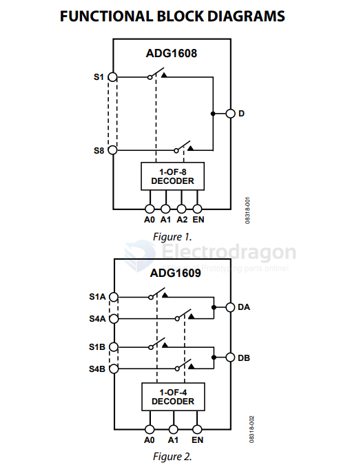

# AD-logic-dat

- [[logic-XOR-dat]] - [[logic-NAND-dat]] - [[logic-inverter-dat]] - [[logic-gate-dat]]

- [[AD-logic-dat]] - [[logic-dat]] - [[multiplexer-dat]] - [[analog-device-dat]]

- [[logic-gate-dat]]

ADG1608/ADG1609 == 4.5 Ω RON, 4-/8-Channel ±5 V, +12 V, +5 V, and +3.3 V Multiplexers

ADG1408/ADG1409 - 4 Ω RON, 4-/8-Channel, ±15 V/+12 V/±5 V iCMOS Multiplexers

ADG1404 - 1.5 Ω On Resistance, ±15 V/12 V/±5 V, 4:1, iCMOS Multiplexer

## ref 

