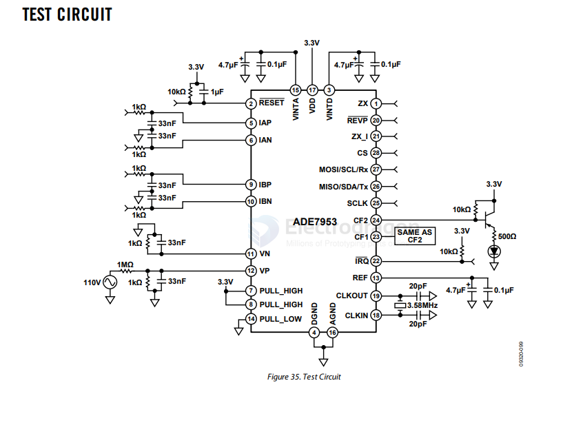
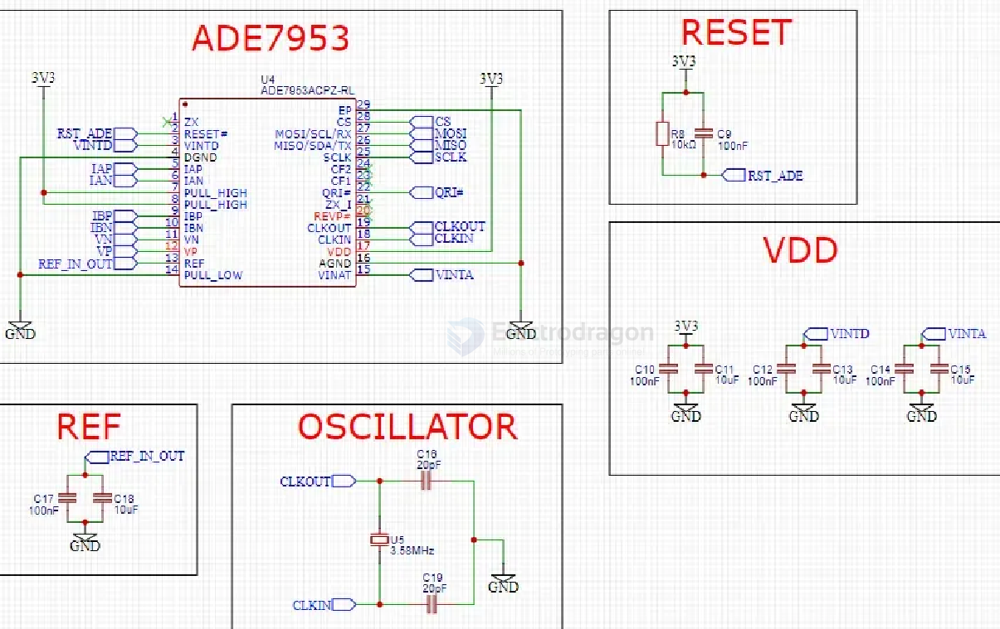
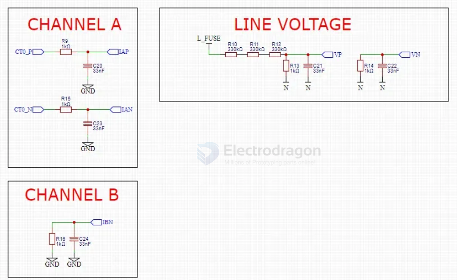
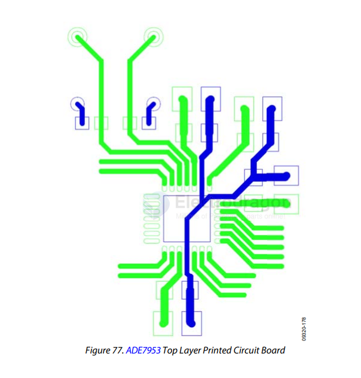

# ADE7953-dat

- [[analog-device-dat]] - [[ADE7953-dat]]

- [[meter-energy-dat]] - [[sensor-energy-dat]] - [[meter-dat]]

- [[current-transformer-dat]] - [[ADE7953-dat]]

- [[ACDC-dat]] - [[meter-energy-dat]]

Single Phase, Multifunction Metering IC with Neutral Current Measurement

## APP SCH 

SCH2 

- [[ESP32-S3-HDK-dat]] - [[74HC4067-dat]] - [[ADE7953-dat]]

channels INA and INB

## layout 

LAYOUT GUIDELINES

Figure 78 presents a basic schematic of the ADE7953 together with its surrounding circuitry, decoupling capacitors at pins VDD, VINTA, VINTD, and REF, and the 3.58 MHz crystal and its load capacitors. The rest of the pins are dependent on the particular application and are not shown here.

Figure 77 presents a proposed layout of a printed circuit board (PCB) with two layers that have the components placed only on the top of the board. Following these layout guidelines will help in creating a low noise design with higher immunity to EMC influences.

The VDD, VINTA, VINTD, and REF pins each have two decoupling capacitors, one of μF order and a ceramic one of 220 nF or 100 nF. These ceramic capacitors need to be placed closest to the ADE7953 as they decouple high frequency noises, while the μF ones need to be place in close proximity.

The exposed pad of the ADE7953 is soldered to an equivalent pad on the PCB. The AGND, DGND, and PULL_LOW pins traces of the ADE7953 are then routed directly in to the PCB pad.

The bottom layer is composed mainly of a ground plane surrounding as much as possible the through hole crystal pins. 

## extend 

- [[multiplexer-dat]]

## ref 

