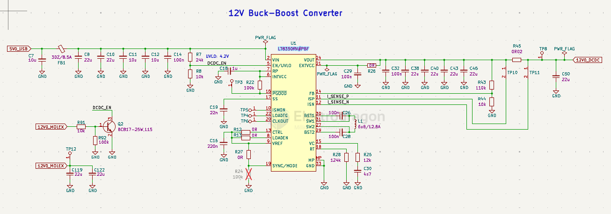
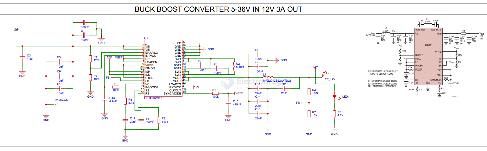

# LT8350-dat

- [[LT8350-dat]] - [[analog-device-dat]] - [[AD-power-dat]]

40VIN, 18VOUT, 6A Synchronous Buck-Boost Silent Switcher

## FEATURES

- n 4-Switch Single Inductor Architecture Allows VIN Above, Below or Equal to VOUT
- n Silent Switcher® Architecture for Low EMI
- n Up to 95% Efficiency at 2MHz
- n Proprietary Peak Current Mode
- n 3V to 40V Input Voltage Range
- n 1V to 18V Output Voltage Range
- n ±1.5% Output Voltage Regulation
- n Output/Input Current Regulation and Monitor
- n Constant-Voltage/Constant-Current Regulation
- n High Side PMOS Load Switch Driver
- n No Top MOSFET Refresh Noise in Buck or Boost
- n 200kHz to 2MHz Fixed Switching Frequency with External Frequency Synchronization and SSFM
- n VOUT Disconnected from VIN During Shutdown
- n Small 4mm × 6mm 32-Pin LQFN Package
- n AEC-Q100 Qualified for Automotive Applications

## SCH app. 

SCH 2 

SCH 1 

## ref 

