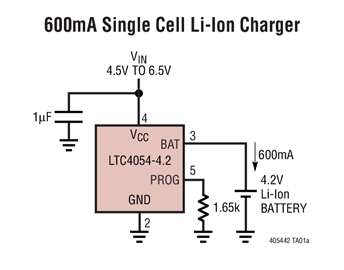

# LTC4054-dat 

- [[LTC4054-dat]] - [[TP4054-dat]] - [[shouding-dat]]

## battery charger 

LTC4054

LTH7 == LTH7 (officially the LTC4054ES5-4.2) is a widely used, single-cell lithium-ion battery charger IC. Packaged in a compact SOT-23-5, it is highly favored for small, portable electronics and DIY hardware projects

- [[fuman-dat]]

- [[LTC4054]]