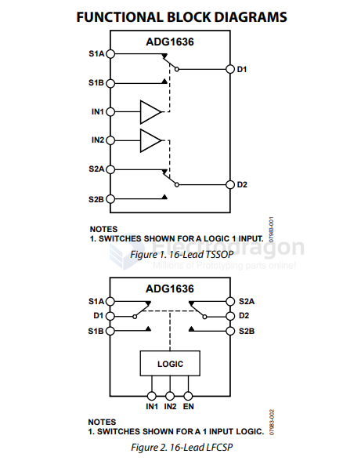

# AD-switch-dat

- [[switch-chip-dat]] - [[power-switch-dat]] - [[AD-switch-dat]]

ADG1636 == 1 Ω Typical On Resistance, ±5 V, +12 V, +5 V, and +3.3 V Dual SPDT Switche

https://www.analog.com/media/en/technical-documentation/data-sheets/ADG1636.pdf

- [[circuits-dat]] - [[logic-dat]]

## ref 

