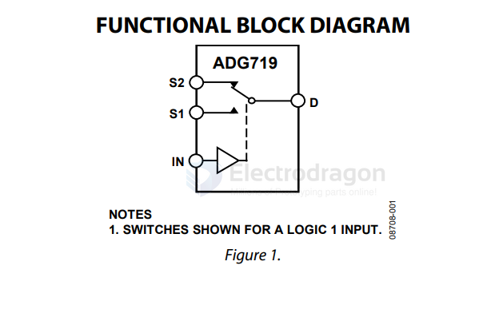
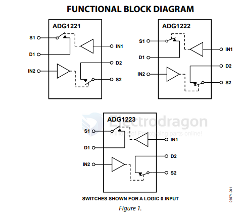
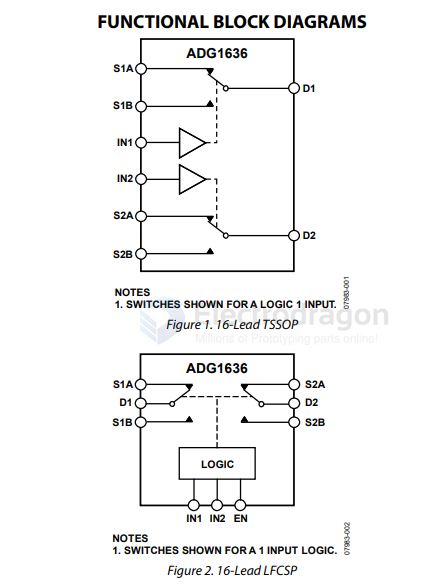

# AD-switch-dat

- [[analog-device-dat]] - [[AD-switch-dat]] - [[ADG719-dat]]

- [[switch-chip-dat]] - [[power-switch-dat]] - [[AD-switch-dat]]

## ADG719

CMOS 1.8 V to 5.5 V, 2.5 Ω 2:1 Mux/SPDT Switch in SOT-23 - ADG719

## ADG1221

ADG1221/ADG1222/ADG1223 == Low Capacitance, Low Charge Injection, ±15 V/+12 V iCMOS® Dual SPST Switches

## ADG1636

ADG1636 == 1 Ω Typical On Resistance, ±5 V, +12 V, +5 V, and +3.3 V Dual SPDT Switche

https://www.analog.com/media/en/technical-documentation/data-sheets/ADG1636.pdf

- [[circuits-dat]] - [[logic-dat]]

## ADG1433

ADG1433/ADG1434 - 4 Ω RON, Triple/Quad SPDT ±15 V/+12 V/±5 V iCMOS Switches

ADG1434YRUZ

## ADG1409

ADG1409YRUZREEL7

## ref 

