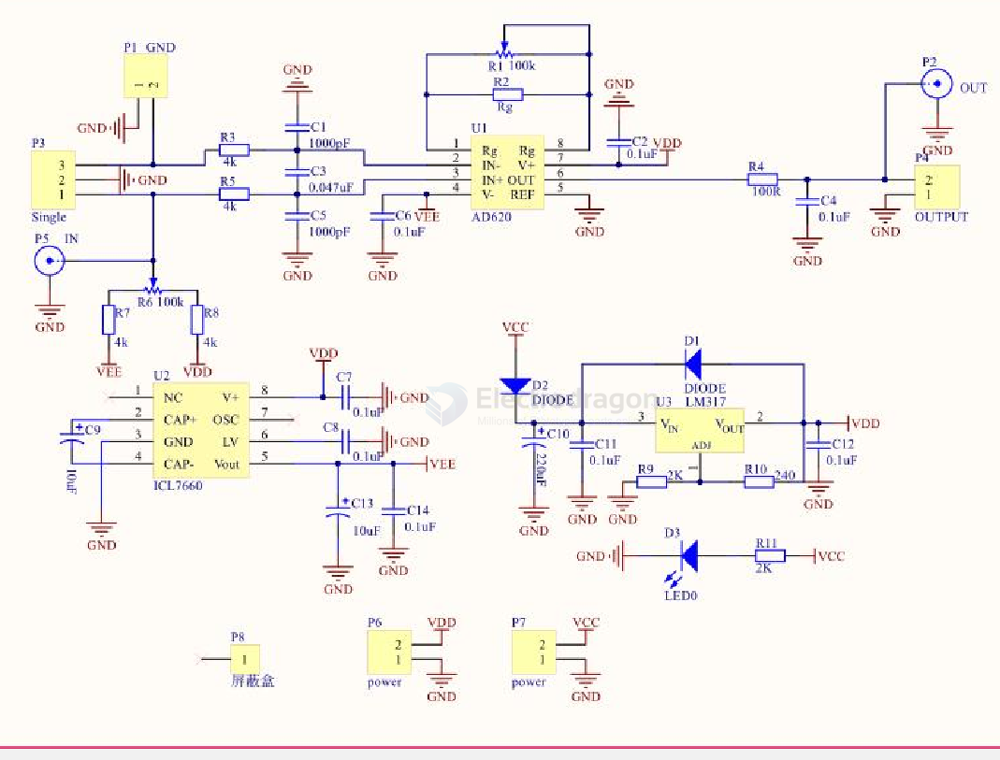

# AD620-dat

- [[AD620-dat]] - [[AD-amplifier-dat]] - [[amplifier-dat]] - [[AD623-dat]]

Low Cost Low Power Instrumentation Amplifier

The AD620 is a low cost, high accuracy instrumentation amplifier that requires only one external resistor to set gains of 1 to 10,000. Furthermore, the AD620 features 8-lead SOIC and DIP packaging that is smaller than discrete designs and offers lower power (only 1.3 mA max supply current), making it a good fit for battery-powered, portable (or remote) applications. 

## SCh 

## ref 

