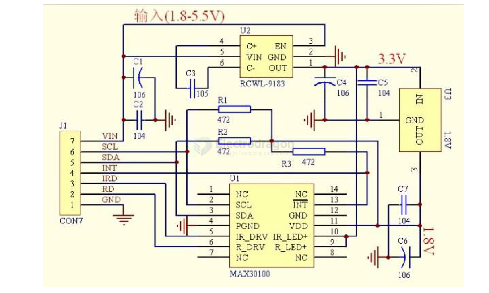

# MAX30102-dat

- datasheet == [[MAX30102.pdf]]

The MAX30102 is an integrated pulse oximeter and heart rate monitor biosensor module. It integrates a red LED and an infrared LED, photodetector, optical components, and low-noise electronic circuitry with ambient light suppression. 

The MAX30102 features a 1.8V power supply and a separate 5.OV power supply for internal LEDs. 

It is used in wearable devices for heart rate and blood oxygen acquisition, and is worn on fingers, earlobes, and wrists. 

The standard 12C-compatible communication interface can transmit the collected values ​​to the Arduino, KL25Z and other microcontrollers for heart rate and blood oxygen calculation. 

In addition, the chip can also shut down the module through software, the standby current is close to zero, and the power supply is always maintained. 

Because of its excellent performance, the chip is widely used in the Samsung Gala x y S series mobile phones. Compared with the previous generation MAX30100, the chip integrates a glass cover to effectively eliminate external and internal light interference, and has the best reliable performance.

- LED peak wavelength 660nm/880nm
- LED supply voltage · 3.3 - 5v
- Detection signal type Light reflection signal (PPG)
- Output signal connection · 12C connection
- Communication interface voltage: 1.8, 3.3V, 5V (optional)
- Board reserved assembly hole size: 0.5 × 8.5 mm

- [[pulse-rate-dat]] - [[human-sensor-dat]]

## SCH 

MAX30100

## Setup

The chip's specified VDD operating voltage must be within 2.2V. To accommodate low-power design considerations, this module's circuit uses a 1.8V regulator to limit the VDD pin voltage to 1.8V. The SCL/SDA/INT pins are pulled up to the 1.8V VDD high level via pull-up resistors, intended for I2C communication with a host controller operating at 1.8V.

Therefore, if you need to communicate with a board operating at a voltage higher than 1.8V, such as an Arduino UNO, you must add external pull-up resistors between the SCL/SDA/INT pins and the VDD of the host board (e.g., 5V for Arduino UNO) to ensure communication quality. See the diagram below:

## Arduino Wiring

Testing Instructions:

1.  Wire according to the diagram above.
2.  Unzip the library file `MAX30100lib` and place it in the Arduino libraries folder. In the Arduino IDE, go to: Sketch >> Include Library >> Add .ZIP Library... >> Select the `MAX30100lib.ZIP` library file.
3.  You can find and open several test programs for the MAX30100 under File >> Examples >> MAX30100lib.
    *   **MAX30100TESTER:** [Description of what this tester does, if known]

## ref 

- [[SMO1013-dat]]