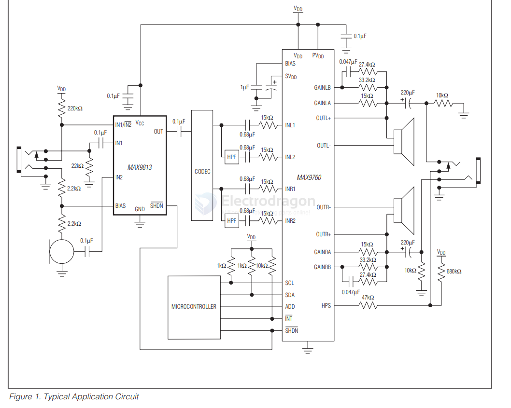
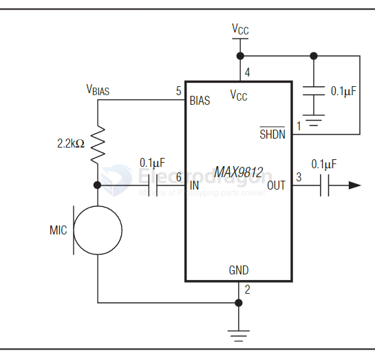
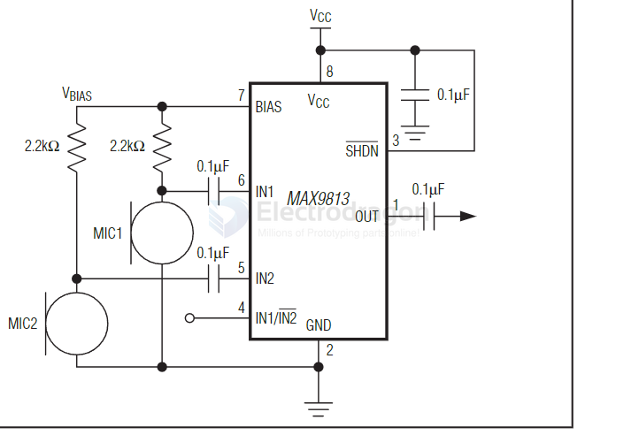
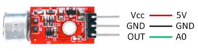

# MAX9812-dat

Tiny, Low-Cost, Single/Dual-Input, Fixed-Gain Microphone Amplifiers with Integrated Bias

datasheet - [Maxim Integrated](https://datasheets.maximintegrated.com/en/ds/MAX9812.pdf)

- [[MAX9812-MAX9813L.pdf]]

## Available in Two Versions

- MAX9812L/MAX9813L—2.7V to 3.6V
- MAX9812H/MAX9813H—4.5V to 5.5V

The  MAX9812  is  a  single  amplifier  in  a  6-pin  SC70 package  (2mm  x  2.1mm)  and  the  MAX9813  is  a  dual- input  amplifier  available  in  an  8-pin  SOT23  (3mm  x 3mm)  package.  

**The  MAX9813  has  two  inputs  allowing two microphones to be multiplexed to a single output.**

The  MAX9812/MAX9813  are  offered  in  two  grades.  The MAX9812L/MAX9813L  are  optimized  for  3.3V  supply operation  (2.7V  to  3.6V).  

The  MAX9812H/MAX9813H  are PC2001  compliant  and  are  optimized  for  5V  operation (4.5V to 5.5V). Both devices are specified over the -40°C to +85°C extended operating temperature range.

## Typical Operating Circuits

MAX9812 

MAX9813 

## arduino connection 

## demo code 

simply run with analog read 

    const int sensorPIN = A0;
    const int sampleWindow = 50; // Window width in mS (50 mS = 20Hz)

    void setup() 
    {
    Serial.begin(9600);
    }

    void loop() 
    {
    unsigned long startMillis= millis();

    unsigned int signalMax = 0;
    unsigned int signalMin = 1024;
    
    // Collect during window
    unsigned int sample;
    while (millis() - startMillis < sampleWindow)
    {
        sample = analogRead(sensorPIN);
        if (sample < 1024)
        {
            if (sample > signalMax)
            {
                signalMax = sample;  // Update maximum
            }
            else if (sample < signalMin)
            {
                signalMin = sample;  // Update minimum
            }
        }
    }
    unsigned int peakToPeak = signalMax - signalMin;  // Sound amplitude
    double volts = (peakToPeak * 5.0) / 1024;  // Convert to voltage
    Serial.println(volts);
    }

## ref 

- [[I2S-microphone-dat]]