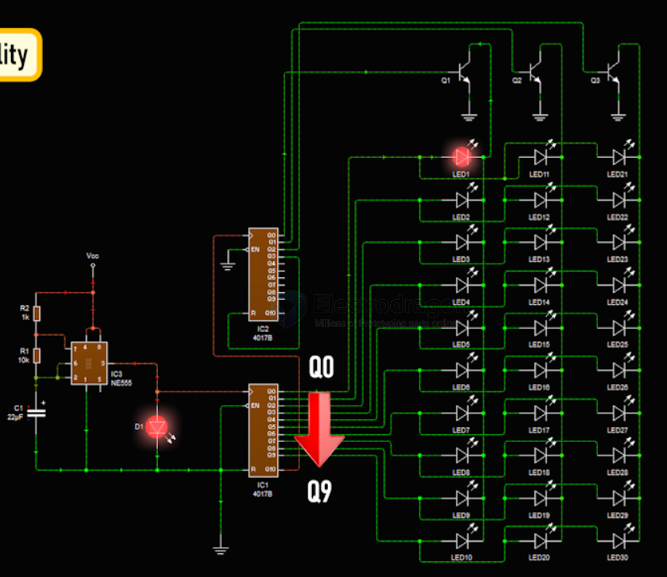

# CD4017-dat

- [[app-dat]] - [[Roulette-Wheel-dat]] - [[shifting-led-dat]] 

- [[NE555-dat]] 

The CD4017 is a 16-pin CMOS `decade counter` and `pulse distributor`. It features 10 decoded output pins that turn on one by one in sequential order (Q₀ through Q₉) each time it receives a rising clock pulse, making it ideal for LED chasers and basic sequential logic without a microcontroller.

## apps 

## ref 

 