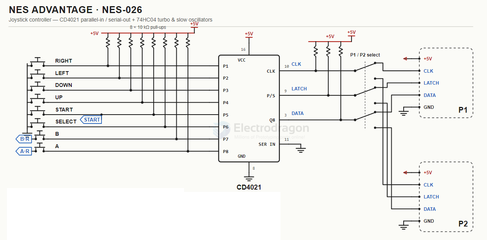

# CD4021-dat

The CD4021 is an 8-stage parallel-input/serial-output CMOS shift register. It allows you to read 8 parallel inputs (like push buttons or switches) using only 3 control pins on a microcontroller like an Arduino,

移位寄存器

- [[CD4021-dat]] - [[CD40xx-dat]]

## apps 

- [[NES-dat]] - [[CD4021-dat]] - [[input-dat]] - [[GPIO-dat]]

- [[playstation-dat]]

## ref 

