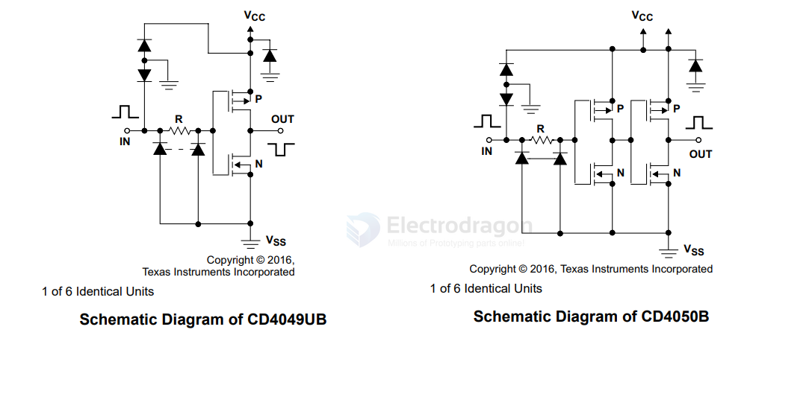

# CD4050-dat

- [[logic-dat]] - [[logic-level-shifter-dat]] 

- [[logic-dat]] - [[buffer-dat]] - [[inverter-dat]] - [[CD40xx-dat]] - [[CD4050-dat]]

The CD4050BM (often mistyped as `CD40504BM`) is a CMOS Hex Non-Inverting Buffer and Logic-Level Converter integrated circuit widely manufactured by semiconductor companies like Texas Instruments and Harris Corporation.

1 Features
• CD4049UB inverting
• CD4050B noninverting
• High sink current for driving 2 TTL loads
• High-to-low level logic conversion
• 100% tested for quiescent current at 20V
• Maximum input current of 1µA at 18V over full package temperature range; 100nA at 18V and 25°C
• 5V, 10V, and 15V parametric ratings

2 Applications
• CMOS to DTL or TTL hex converters
• CMOS current sink or source drivers
• CMOS high-to-low logic level converters

## ref 