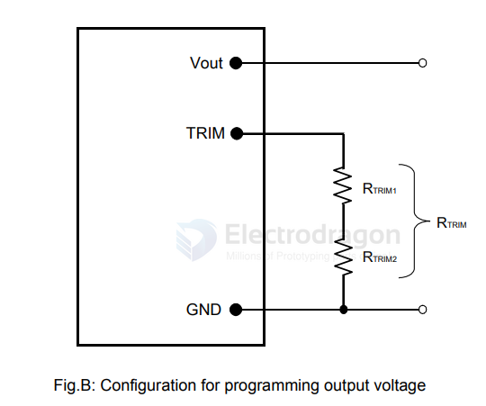

# DFK-dat

FPDK12SR8006PSX

FPDK12SR8006PS*

5.6-14.0Vdc Input, 6A, 0.8-6.6Vdc Output

The DK Series of non-isolated dc-dc converters provide high efficiency, cost effective, and complete Point-of-Load power solutions in very small and low profile SMD packages. 

Occupying a footprint of less than 2 cm (0.3 in²), these are the converters of communications, computing, industrial and consumer applications where boardspace, cost, height, efficiency, and reliable operation in elevated temperature environments are critical.

