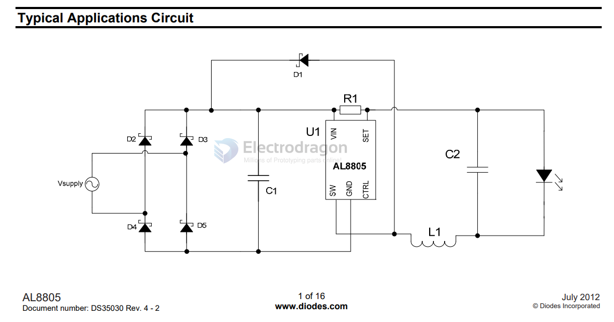
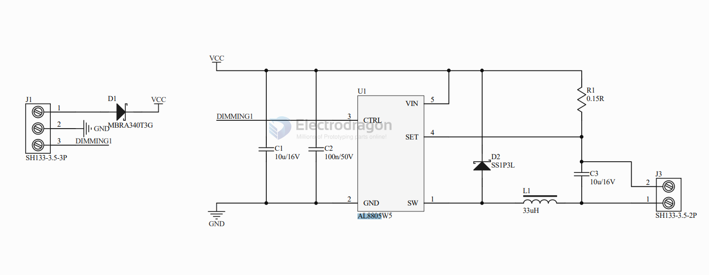
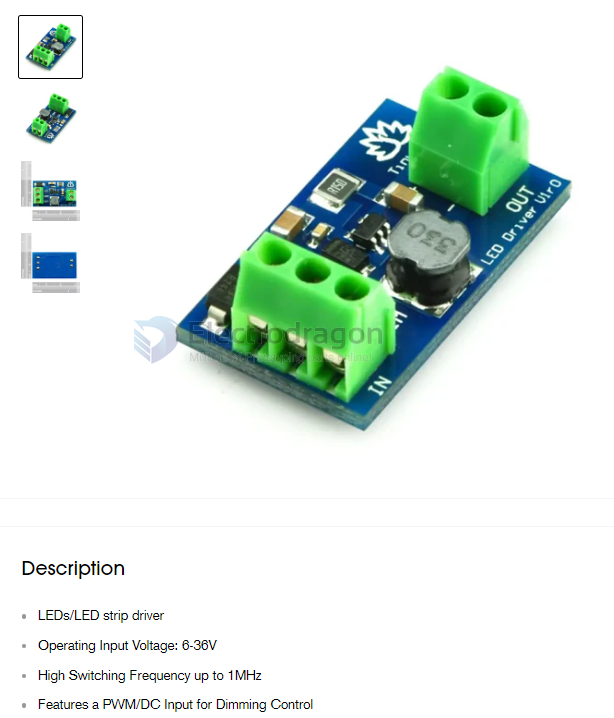

# AL8805-dat

## Features

- • LED Driving Current up to 1A
- • Better than 5% Accuracy
- • High Efficiency up to 98%
- • Operating Input Voltage from 6V to 36V
- • High Switching Frequency up to 1MHz
- • PWM/DC Input for Dimming Control
- • Built-In Output Open-Circuit Protection
- • SOT25: 

## SCH 

## modules 

- picohuck board - https://learn.sparkfun.com/tutorials/picobuck-hookup-guide

