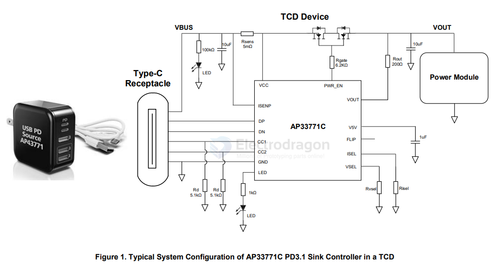
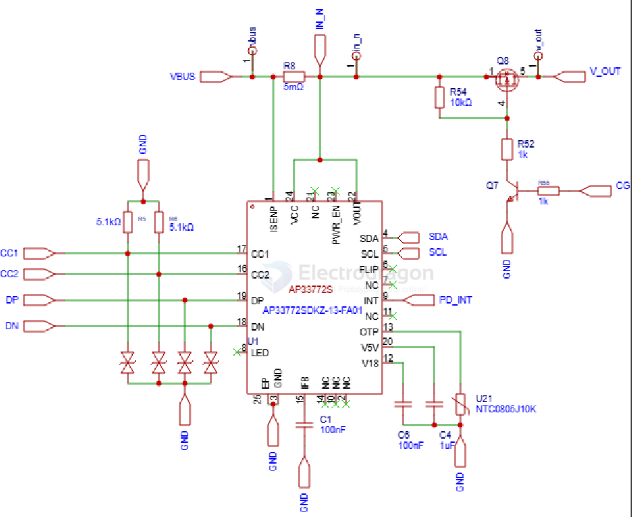

# AP3377-dat

- [[diodes-dat]] - [[AP3377-dat]] - [[USB-PD-dat]]

- [[INA226-dat]]

EASY-TO-USE USB PD3.1 EPR SINK CONTROLLER

The AP33771C is a highly integrated USB Type-C® PD3.1 sink controller to support Extended Power Range (EPR)/Adjustable Voltage Supply (AVS) up to 28V and Standard Power Range (SPR)/ Programmable Power Supply (PPS) up to 21V. The device is targeted for DC power request and control for Type-C Connector-equipped Devices (TCDs) through simple external resistor setting.

For a simple TCD without a system MCU, the AP33771C initiates desired power request based on resistance values connected on the VSEL pin (voltage) and ISEL pin (current), after Power-On Reset (POR), see Table 2 for details. 

## SCH 

## Build 

- 3 VCC AHV The Power Supply of the AP33771C. A 1µF cap is required to connect this pin to GND pin.
- 4 ISENP AHV Current Sense Positive Node. 

between - ISENP - VCC

- [[diodes-dat]] - [[AP3377-dat]] - [[USB-PD-dat]] - [[INA226-dat]] 

## ref 

