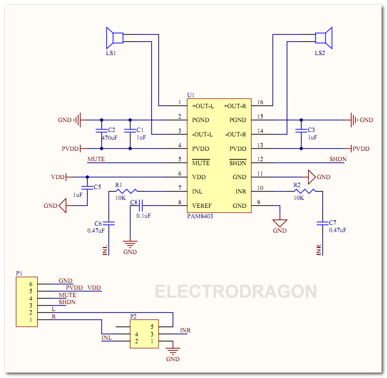

# PAM8403-dat 

## SCH 

## Design Notes PAM8403
* Two ends of C32 and C34 must connect over PVDD and PGND.
* To prevent to noises to speaker: 
    * Pin 3 and Pin 14 should go under the IC to the speaker
    * Pin 4 and Pin 13 should NOT go under the IC to the speaker
    * Pin 2 and Pin 15 should NOT go under the IC to the speaker
* Pin 6 VDD should separated with PVDD, pass C36 cap and after relatively long distance, and finally connect to VCC pin from two trace lines (to make this distance).
* Not recommended to use single layer board.
* circuits in the dot line box is optional.

## ref 

- [[PAM8403.pdf]]