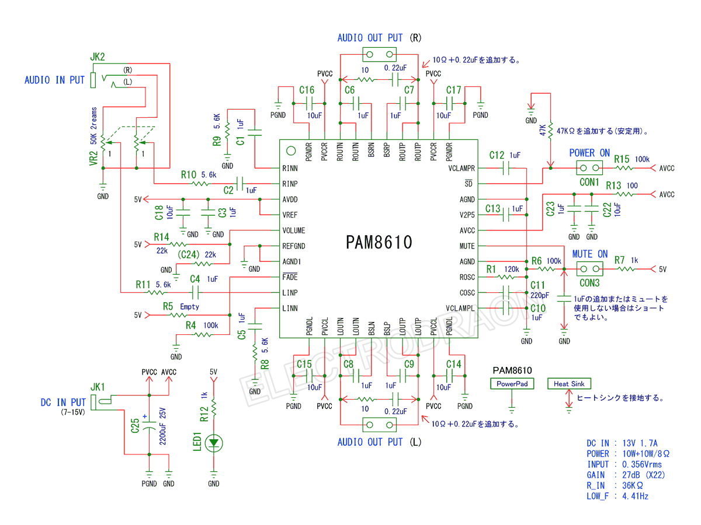
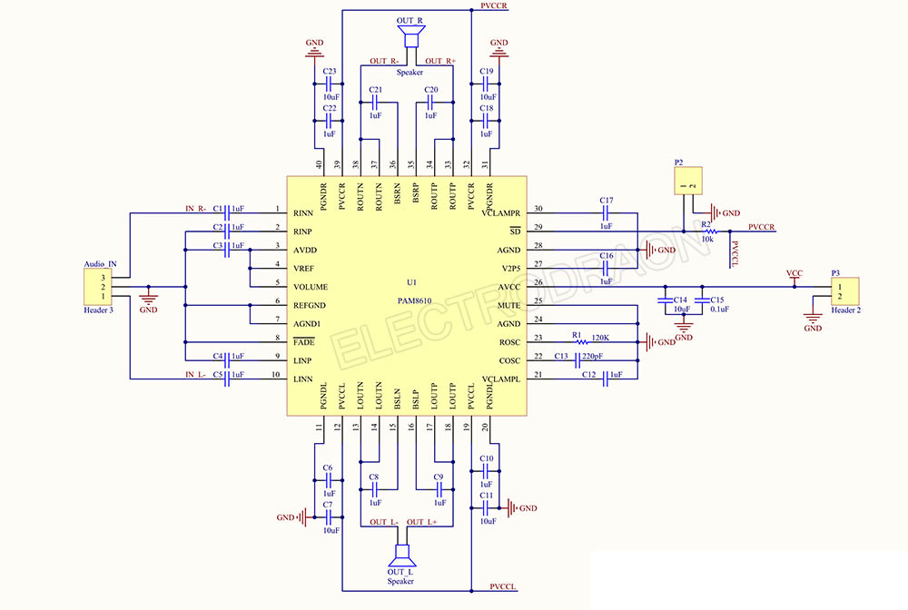

# PAM8610-dat

- [[pam8610-dat]] - [[pam-dat]] - [[amplifier-audio-dat]]

PAM8610芯片，PAM8610芯片是10W（每个通道）D级立体声的音频放大器。高质量语音再生功能，低THD十N（0.1%）无滤波器，很好的PSRR，新型直接输出驱动扬声器无需低通滤波器。

在10V供电8Q负载具有10%THD的10W。无滤波器，低静态电流，超低EMI，具有关断／静音消噪功能。

高效率90%，超低噪音输出-90dB，工作电压7一13.5V，低THD十N，和低静态电流，低功耗，发热量小。具有过流／温度/短路保护

## boards 

- [[AMP1000-dat]]

## SCH 

## ref 

- [[amplifier-audio-dat]]

