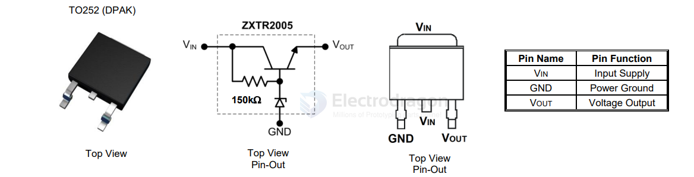

# ZXTR2005K-dat

Features
- Series Linear Regulator Using Emitter-Follower Stage
- Input Voltage = 10 to 100V (For regulated output voltage)
- Output Voltage = 5V ± 10%
- 150kΩ resistor to limit quiescent current
- Fully Integrated Into a TO252 Package
- Totally Lead-Free & Fully RoHS Compliant (Notes 1 & 2)
- Halogen and Antimony Free. “Green” Device (Note 3)
- Qualified to AEC-Q101 for High Reliability

SCH 

## ref 