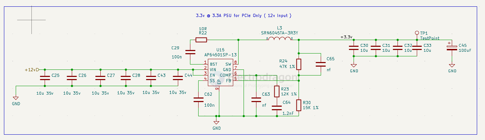
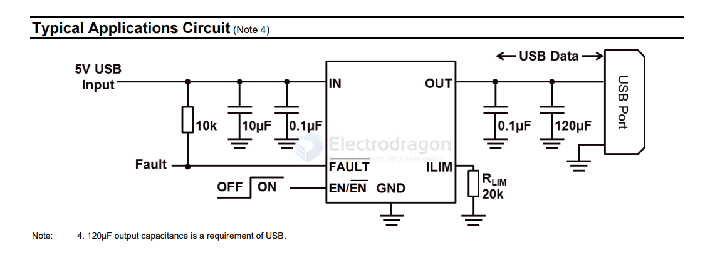

# diodes-dat 

- AP64501 == 3.8V TO 40V INPUT, 5A LOW IQ SYNCHRONOUS BUCK WITH PROGRAMMABLE SOFT-START TIME

- [[DCDC-down-dat]]

## current-limit power switch 

AP22652/AP22653/AP22652A/AP22653A

PRECISION ADJUSTABLE CURRENT-LIMITED POWER SWITCHES

https://www.diodes.com/datasheet/download/AP22652_AP22653_AP22652A_AP22653A.pdf

The AP22652, AP22653, AP22652A, and AP22653A are singlechannel, precision-adjustable, current-limited switches optimized for applications that require precision current limiting, or to provide up to 2.1A of continuous load current during heavy loads/short circuits. 

These devices offer a programmable current-limit threshold between 125mA and 2665mA (typ) via an external resistor. Current-limit accuracy ±10% can be achieved at high current-limit settings. The rise and fall times are controlled to minimize current surges during turn on/off.

## audio 

- [[PAM8302-dat]]

- [[PAM8403-dat]] 
- [[PAM8406-dat]]
- [[PAM8610-dat]]

## led drivers 

- [[AL8805-dat]]