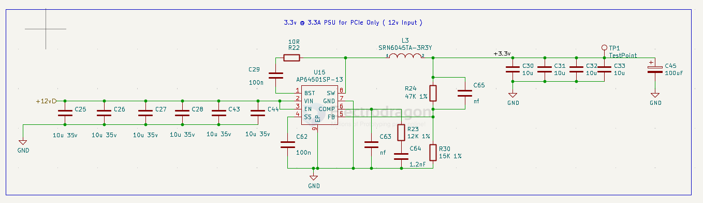
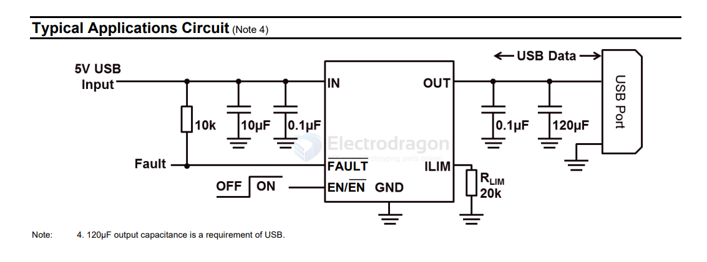

# diodes-dat

## DCDC

### AP3512E
The **AP3512E** (by Diodes Incorporated) is an **18V, 2A synchronous step-down DC-DC converter**. It features a fixed 500kHz switching frequency, an integrated N-channel power MOSFET, and current-mode control.

**Key Specifications:**
| Parameter             | Value                                               |
| --------------------- | --------------------------------------------------- |
| Input Voltage Range   | 4.5V to 18V                                         |
| Output Current        | Up to 2A continuous                                 |
| Feedback Voltage      | 0.8V adjustable                                     |
| Switching Frequency   | 500kHz                                              |
| Operating Temperature | -40°C to +85°C                                      |
| Protection            | OVP, UVLO, programmable soft-start, hiccup mode SCP |

[Download AP3512E Datasheet](https://www.diodes.com/datasheet/download/AP3512E)

### AP64501
- **AP64501** — 3.8V to 40V input, 5A low IQ synchronous buck with programmable soft-start time

### Related
- [[DCDC-down-dat]]

## current-limit power switch

### AP22652 / AP22653 / AP22652A / AP22653A
**Precision Adjustable Current-Limited Power Switches**

[Datasheet](https://www.diodes.com/datasheet/download/AP22652_AP22653_AP22652A_AP22653A.pdf)

The AP22652, AP22653, AP22652A, and AP22653A are single-channel, precision-adjustable, current-limited switches optimized for applications that require precision current limiting, or to provide up to 2.1A of continuous load current during heavy loads/short circuits.

These devices offer a programmable current-limit threshold between 125mA and 2665mA (typ) via an external resistor. Current-limit accuracy ±10% can be achieved at high current-limit settings. The rise and fall times are controlled to minimize current surges during turn on/off.

## audio

- [[PAM8302-dat]]
- [[PAM8403-dat]]
- [[PAM8406-dat]]
- [[PAM8610-dat]]

## led drivers

- [[AL8805-dat]]

## LDO

- [[ZXTR2005K-dat]] — [[diode-dat]] — [[LDO-dat]]

## ref 