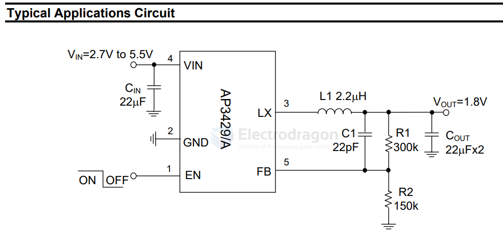
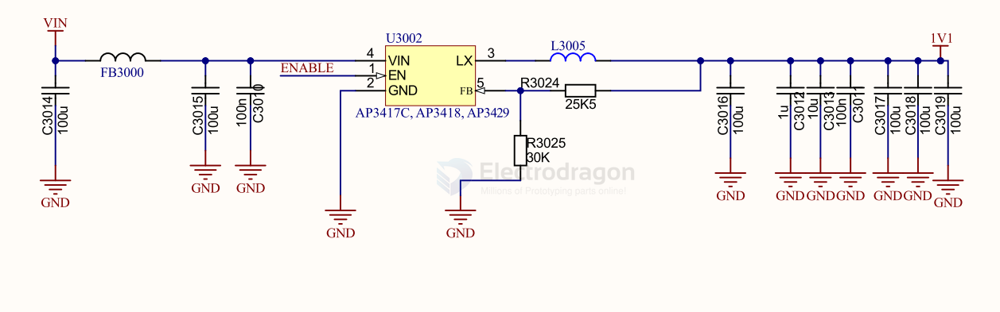

# diodes-power-dat

- [[AP3417-dat]] - [[AP3418-dat]] - [[AP3429-dat]] - [[diodes-power-dat]] - [[diodes-dat]]

1.0MHZ, 2A STEP-DOWN DC-DC BUCK CONVERTER

The AP3429/A is a 2A step-down DC-DC converter. At heavy load, the constant frequency PWM control performs excellent stability and transient response. No external compensation components are required.

The AP3429/A supports a range of input voltages from 2.7V to 5.5V, allowing the use of a single Li+/Li- polymer cell, multiple Alkaline/NiMH cell, and other standard power sources. The output voltage is adjustable from 0.6V to the input voltage. The AP3429/A employs internal power switch and synchronous rectifier to minimize external part count and realize high efficiency. During shutdown, the input is disconnected from the output and the shutdown current is less than 1μA. Other key features include overtemperature and short-circuit protection, and undervoltage lockout to prevent deep battery discharge.

The AP3429/A delivers 2A maximum output current while consuming only 90μA of no-load quiescent current. Ultra-low RDS(ON) integrated MOSFETs and 100% duty cycle operation make the AP3429/A an ideal choice for high output voltage, high current applications which require a low dropout threshold.

The AP3429/A is available in TSOT25 package.

## SCH 

## build 

## ref 

